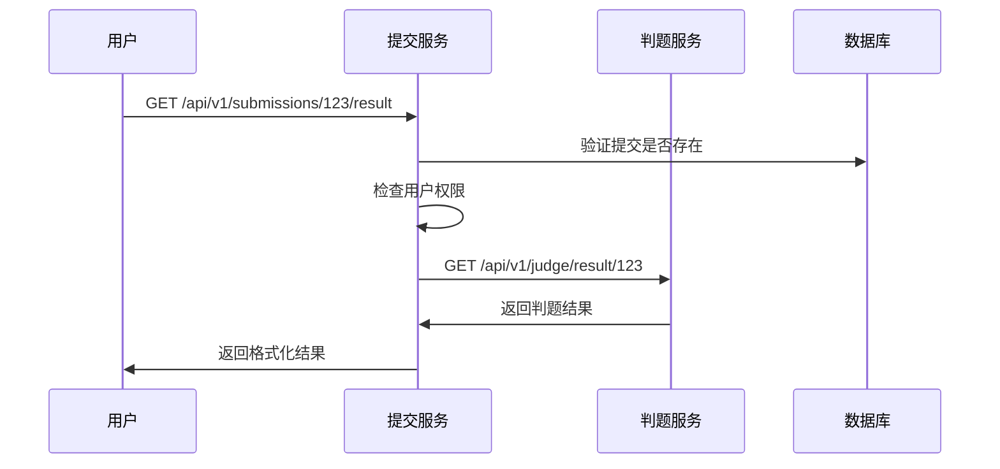

# 跨服务调用架构设计

## 问题分析

### 原始问题
- **判题服务接口**：提供判题结果、状态查询、取消任务、重新判题等功能
- **用户需求**：用户需要访问这些判题相关功能
- **架构原则**：判题服务作为内部服务，不应直接暴露给用户

### 解决方案
**提交服务作为统一API网关**，代理用户对判题服务的访问。

## 架构设计

### 1. 服务职责划分

```
┌─────────────────┐    ┌─────────────────┐    ┌─────────────────┐
│   前端/用户      │    │   提交服务       │    │   判题服务       │
│                │    │  (API Gateway)   │    │  (Internal)     │
├─────────────────┤    ├─────────────────┤    ├─────────────────┤
│ • 提交代码       │───▶│ • 用户认证       │    │ • 代码编译       │
│ • 查看结果       │    │ • 权限检查       │    │ • 测试用例执行    │
│ • 查看状态       │    │ • 数据持久化     │◀──▶│ • 资源监控       │
│ • 重新判题       │    │ • 业务逻辑       │    │ • 任务调度       │
│ • 取消任务       │    │ • 服务代理       │    │ • 结果计算       │
└─────────────────┘    └─────────────────┘    └─────────────────┘
```

### 2. API设计对比

#### 原来的设计（错误）
```
用户 ──直接调用──▶ 判题服务 /api/v1/judge/*
```

#### 正确的设计
```
用户 ──调用──▶ 提交服务 /api/v1/submissions/* ──代理──▶ 判题服务 /api/v1/judge/*
```

### 3. 接口映射关系

| 用户访问的接口 | 提交服务代理接口 | 判题服务内部接口 | 功能说明 |
|---------------|-----------------|----------------|----------|
| `GET /api/v1/submissions/{id}/result` | `getSubmissionJudgeResult` | `GET /api/v1/judge/result/{id}` | 获取判题结果 |
| `GET /api/v1/submissions/{id}/status` | `getSubmissionJudgeStatus` | `GET /api/v1/judge/status/{id}` | 获取判题状态 |
| `POST /api/v1/submissions/{id}/rejudge` | `rejudgeSubmission` | `POST /api/v1/judge/rejudge/{id}` | 重新判题 |
| `DELETE /api/v1/submissions/{id}` | `cancelSubmission` | `DELETE /api/v1/judge/cancel/{id}` | 取消判题 |
| `GET /api/v1/admin/submissions/judge/queue` | `getJudgeQueueStatus` | `GET /api/v1/judge/queue` | 查看队列状态 |

## 实现详情

### 1. 提交服务中的客户端实现

```go
// services/submission-api/internal/client/judge_client.go
type JudgeServiceClient interface {
    GetJudgeResult(ctx context.Context, submissionID int64) (*JudgeResultResp, error)
    GetJudgeStatus(ctx context.Context, submissionID int64) (*JudgeStatusResp, error)
    CancelJudge(ctx context.Context, submissionID int64) (*CancelJudgeResp, error)
    RejudgeSubmission(ctx context.Context, submissionID int64) (*RejudgeResp, error)
    GetJudgeQueue(ctx context.Context) (*JudgeQueueResp, error)
}
```

### 2. 权限控制策略

#### 用户权限
- **查看判题结果/状态**：只能查看自己的提交
- **重新判题**：只能重判自己的提交
- **取消任务**：只能取消自己的提交

#### 管理员权限
- **查看队列状态**：只有管理员和教师可以查看
- **重判任何提交**：管理员和教师可以重判任何提交
- **系统监控**：完整的判题系统状态监控

### 3. 代理逻辑流程



### 4. 错误处理策略

#### 权限错误
```json
{
  "code": 403,
  "message": "无权查看此提交的判题结果"
}
```

#### 服务不可用
```json
{
  "code": 500,
  "message": "获取判题结果失败"
}
```

#### 资源不存在
```json
{
  "code": 404,
  "message": "提交记录不存在"
}
```

## 配置说明

### 提交服务配置
```yaml
# services/submission-api/etc/submission-api.yaml
JudgeService:
  Endpoint: "http://localhost:8890"  # 判题服务内网地址
  Timeout: 30                        # 超时时间(秒)
```

### 判题服务配置
```yaml
# services/judge-api/etc/judge-api.yaml
Host: 0.0.0.0
Port: 8890  # 内网端口，不对外暴露
```

## 安全考虑

### 1. 网络隔离
- 判题服务只监听内网地址
- 通过防火墙规则限制外部访问
- 使用VPC或私有网络隔离

### 2. 服务认证
```go
// 可选：服务间认证
req.Header.Set("X-Service-Token", "internal-service-secret")
```

### 3. 数据脱敏
- 敏感信息（如测试用例输入）根据权限过滤
- 错误信息不暴露内部系统细节

## 监控和日志

### 1. 调用链追踪
```go
// 传递请求ID用于链路追踪
req.Header.Set("X-Request-ID", requestID)
```

### 2. 性能监控
- 代理接口响应时间
- 判题服务调用成功率
- 错误率统计

### 3. 业务日志
```go
logx.Infof("代理调用判题服务: SubmissionID=%d, UserID=%d, Action=%s", 
    submissionID, userID, action)
```

## 扩展性设计

### 1. 负载均衡
```go
// 支持多个判题服务实例
type JudgeServiceConf struct {
    Endpoints []string `json:"endpoints"`
    LoadBalance string `json:"load_balance"` // round_robin, random, weighted
}
```

### 2. 熔断机制
```go
// 集成熔断器
import "github.com/sony/gobreaker"

var cb *gobreaker.CircuitBreaker
```

### 3. 缓存策略
```go
// 缓存判题结果
type CachedJudgeResult struct {
    Result    *JudgeResult
    CachedAt  time.Time
    TTL       time.Duration
}
```

## 优势总结

### 1. 安全性
- 判题服务完全内网隔离
- 统一的权限控制和认证
- 防止直接攻击判题服务

### 2. 可维护性
- 清晰的服务边界
- 统一的API入口
- 便于监控和调试

### 3. 可扩展性
- 支持多个判题服务实例
- 便于添加缓存、限流等功能
- 支持服务升级和迁移

### 4. 用户体验
- 统一的API风格
- 一致的错误处理
- 完整的权限控制

这种架构设计确保了系统的安全性、可维护性和可扩展性，同时为用户提供了统一、安全的API访问体验。


