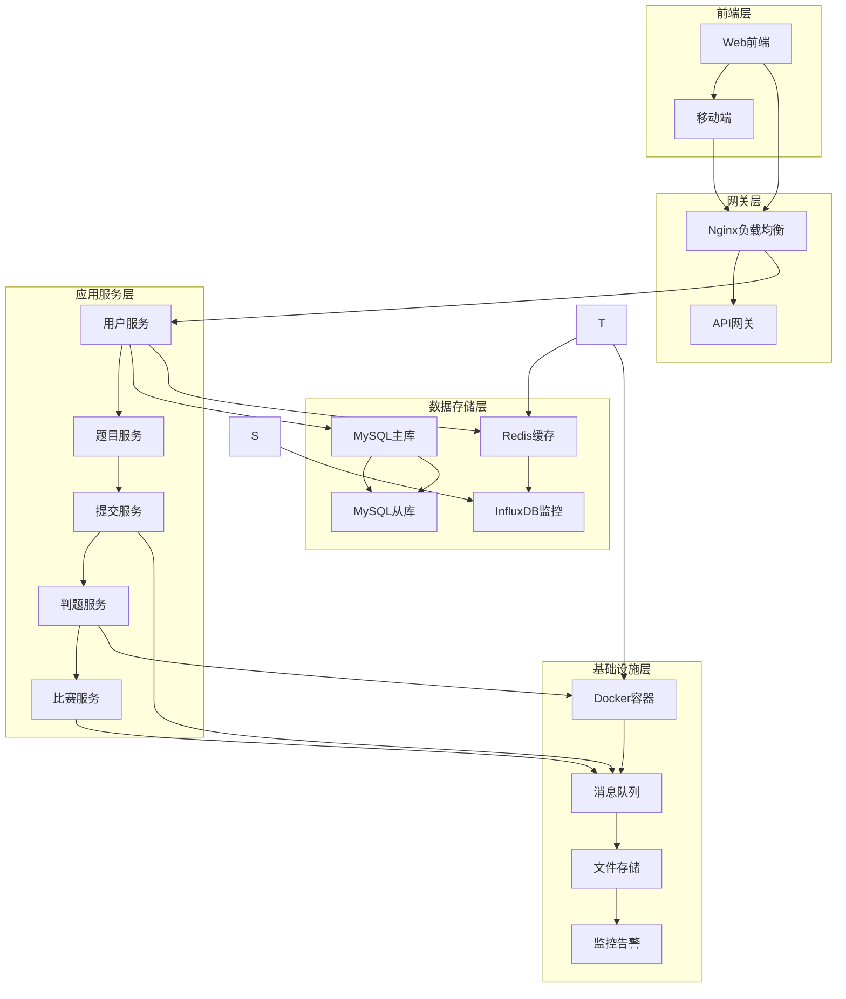
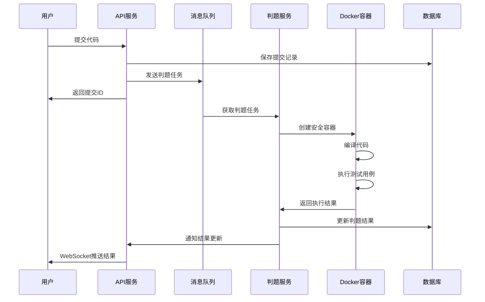

# 基于Go语言的在线判题系统(Online Judge System)

## 目录
- [项目概述](#项目概述)
- [1. 业务功能分析](#1-业务功能分析)
  - [1.1 核心功能模块](#11-核心功能模块)
  - [1.2 API接口设计](#12-api接口设计)
  - [1.3 关键技术难点](#13-关键技术难点)
- [2. 系统架构设计](#2-系统架构设计)
  - [2.1 整体架构](#21-整体架构)
  - [2.2 数据库设计](#22-数据库设计)
  - [2.3 判题流程](#23-判题流程)
  - [2.4 安全措施](#24-安全措施)
- [3. 开发计划](#3-开发计划)
  - [3.1 开发阶段规划](#31-开发阶段规划)
  - [3.2 技术债务管理](#32-技术债务管理)
  - [3.3 风险评估与应对](#33-风险评估与应对)

---

## 项目概述

本项目旨在开发一个高性能、高安全性的在线判题系统，支持多种编程语言的代码提交与自动化判题。系统采用微服务架构，使用Go语言作为主要开发语言，具备良好的扩展性和并发处理能力。

### 主要特性
- 🚀 高性能：基于Go语言，支持高并发处理
- 🔒 高安全性：沙箱隔离执行，防止恶意代码攻击
- 🎯 多语言支持：支持C/C++、Java、Python、Go等主流编程语言
- 📊 实时监控：完整的系统监控和日志记录
- 🔧 易扩展：微服务架构，便于功能扩展和维护

---

## 1. 业务功能分析

### 1.1 核心功能模块

#### 用户管理模块 (User Management)
**功能描述**: 处理用户注册、登录、权限管理等功能

##### 1.1.1 业务功能概述

用户服务作为在线判题系统的核心基础服务，负责管理系统中所有用户的生命周期，包括身份认证、权限控制、个人信息管理等关键功能。该服务需要支持高并发用户访问，确保数据安全性和系统稳定性。

##### 1.1.2 功能优先级表格

| 优先级 | 功能分类 | 具体功能 | 业务价值 | 技术复杂度 |
|--------|----------|----------|----------|------------|
| **P0 (核心功能)** | 身份认证 | 用户注册 | 用户获取系统访问权限 | 中 |
| **P0 (核心功能)** | 身份认证 | 用户登录/登出 | 用户身份验证和会话管理 | 中 |
| **P0 (核心功能)** | 权限控制 | JWT令牌管理 | 无状态认证，支持分布式部署 | 高 |
| **P0 (核心功能)** | 权限控制 | 基础RBAC权限控制 | 区分学生、教师、管理员角色 | 高 |
| **P1 (重要功能)** | 信息管理 | 个人信息修改 | 用户体验提升 | 低 |
| **P1 (重要功能)** | 信息管理 | 密码修改 | 账户安全管理 | 中 |
| **P1 (重要功能)** | 会话管理 | 多设备登录控制 | 安全性和用户体验平衡 | 中 |
| **P1 (重要功能)** | 安全功能 | 邮箱验证 | 提升注册质量，防止垃圾账户 | 中 |
| **P2 (扩展功能)** | 统计分析 | 用户行为统计 | 业务数据分析 | 中 |
| **P2 (扩展功能)** | 安全功能 | 登录频率限制 | 防止暴力破解 | 中 |
| **P2 (扩展功能)** | 社交功能 | 用户关注/粉丝 | 社区功能增强 | 中 |
| **P2 (扩展功能)** | 高级认证 | 第三方登录(OAuth) | 提升用户体验 | 高 |
| **P2 (扩展功能)** | 高级认证 | 双因子认证(2FA) | 提升账户安全性 | 高 |

##### 1.1.3 API接口设计

###### 核心认证接口

| 接口名称 | HTTP方法 | 路径 | 功能描述 |
|----------|----------|------|----------|
| 用户注册 | POST | `/api/v1/auth/register` | 新用户注册 |
| 用户登录 | POST | `/api/v1/auth/login` | 用户身份验证 |
| 用户登出 | POST | `/api/v1/auth/logout` | 用户会话注销 |
| 刷新令牌 | POST | `/api/v1/auth/refresh` | JWT令牌刷新 |
| 邮箱验证 | POST | `/api/v1/auth/verify-email` | 邮箱验证确认 |

**用户注册接口详细设计**：
```json
// POST /api/v1/auth/register
{
  "username": "student123",
  "email": "student@example.com", 
  "password": "SecurePass123!",
  "confirm_password": "SecurePass123!",
  "role": "student"
}

// 响应格式
{
  "code": 200,
  "message": "注册成功",
  "data": {
    "user_id": 1001,
    "username": "student123",
    "email": "student@example.com",
    "role": "student",
    "created_at": "2024-01-15T10:30:00Z"
  }
}
```

**用户登录接口详细设计**：
```json
// POST /api/v1/auth/login
{
  "username": "student123",
  "password": "SecurePass123!"
}

// 响应格式
{
  "code": 200,
  "message": "登录成功",
  "data": {
    "access_token": "eyJhbGciOiJIUzI1NiIsInR5cCI6IkpXVCJ9...",
    "refresh_token": "eyJhbGciOiJIUzI1NiIsInR5cCI6IkpXVCJ9...",
    "token_type": "Bearer",
    "expires_in": 3600,
    "user_info": {
      "user_id": 1001,
      "username": "student123",
      "email": "student@example.com",
      "role": "student"
    }
  }
}
```

###### 用户信息管理接口

| 接口名称 | HTTP方法 | 路径 | 功能描述 |
|----------|----------|------|----------|
| 获取个人信息 | GET | `/api/v1/users/profile` | 获取当前用户信息 |
| 更新个人信息 | PUT | `/api/v1/users/profile` | 更新用户基本信息 |
| 修改密码 | PUT | `/api/v1/users/password` | 修改用户密码 |
| 获取用户统计 | GET | `/api/v1/users/{user_id}/stats` | 获取用户提交统计 |
| 用户列表 | GET | `/api/v1/users` | 获取用户列表(管理员) |

###### 权限管理接口

| 接口名称 | HTTP方法 | 路径 | 功能描述 |
|----------|----------|------|----------|
| 角色权限验证 | POST | `/api/v1/auth/verify-permission` | 验证用户权限 |
| 更新用户角色 | PUT | `/api/v1/users/{user_id}/role` | 修改用户角色(管理员) |
| 获取用户权限 | GET | `/api/v1/users/{user_id}/permissions` | 获取用户权限列表 |

##### 1.1.4 技术难点分析

###### 1. 密码安全存储
**技术挑战**：
- 用户密码需要安全存储，防止数据泄露后被破解
- 密码验证需要高效，不能影响登录性能
- 需要支持密码复杂度验证

**解决方案**：
- **密码哈希算法**：使用bcrypt算法进行密码哈希，成本因子设置为12
- **盐值处理**：bcrypt内置随机盐值，防彩虹表攻击
- **密码复杂度**：前端+后端双重验证，确保密码强度

```go
// 密码哈希示例
func HashPassword(password string) (string, error) {
    hash, err := bcrypt.GenerateFromPassword([]byte(password), 12)
    if err != nil {
        return "", err
    }
    return string(hash), nil
}

// 密码验证示例
func VerifyPassword(hashedPassword, password string) bool {
    err := bcrypt.CompareHashAndPassword([]byte(hashedPassword), []byte(password))
    return err == nil
}
```

###### 2. JWT令牌管理
**技术挑战**：
- JWT无状态特性导致令牌撤销困难
- 令牌过期时间平衡安全性和用户体验
- 防止令牌被盗用和重放攻击

**解决方案**：
- **双令牌机制**：AccessToken(短期) + RefreshToken(长期)
- **令牌黑名单**：Redis存储已撤销的令牌ID，实现强制登出
- **安全配置**：HTTPS传输、HttpOnly Cookie、CSRF保护

```go
// JWT令牌结构设计
type Claims struct {
    UserID   int64  `json:"user_id"`
    Username string `json:"username"`
    Role     string `json:"role"`
    TokenID  string `json:"jti"` // 用于黑名单机制
    jwt.StandardClaims
}

// 令牌配置
const (
    AccessTokenExpire  = 15 * time.Minute  // 访问令牌15分钟
    RefreshTokenExpire = 7 * 24 * time.Hour // 刷新令牌7天
)
```

###### 3. 高并发用户认证
**技术挑战**：
- 用户登录高峰期需要处理大量并发认证请求
- 数据库查询压力大，影响响应性能
- 需要防止认证服务成为系统瓶颈

**解决方案**：
- **多级缓存**：Redis缓存用户基本信息，减少数据库查询
- **数据库优化**：用户名和邮箱字段建立唯一索引
- **连接池管理**：合理配置数据库连接池，避免连接耗尽

```go
// 缓存策略设计
type UserCache struct {
    redis *redis.Client
}

// 用户信息缓存键格式
const (
    UserCacheKeyFormat = "user:info:%d"     // user:info:1001
    UserCacheTTL       = 30 * time.Minute   // 缓存30分钟
)

// 缓存用户信息
func (uc *UserCache) SetUserInfo(userID int64, user *User) error {
    key := fmt.Sprintf(UserCacheKeyFormat, userID)
    data, _ := json.Marshal(user)
    return uc.redis.Set(context.Background(), key, data, UserCacheTTL).Err()
}
```

###### 4. 权限控制设计
**技术挑战**：
- RBAC权限模型设计的灵活性和性能平衡
- 权限验证的性能优化
- 权限变更的实时生效

**解决方案**：
- **简化RBAC模型**：基于角色的三级权限（学生、教师、管理员）
- **权限中间件**：go-zero中间件实现统一权限验证
- **权限缓存**：Redis缓存用户权限信息，权限变更时清除缓存

```go
// 权限中间件设计
func AuthMiddleware(next http.HandlerFunc) http.HandlerFunc {
    return func(w http.ResponseWriter, r *http.Request) {
        token := extractToken(r)
        claims, err := validateToken(token)
        if err != nil {
            http.Error(w, "Unauthorized", http.StatusUnauthorized)
            return
        }
        
        // 检查权限
        if !hasPermission(claims.Role, r.URL.Path, r.Method) {
            http.Error(w, "Forbidden", http.StatusForbidden)
            return
        }
        
        // 将用户信息加入上下文
        ctx := context.WithValue(r.Context(), "user", claims)
        next(w, r.WithContext(ctx))
    }
}
```

###### 5. 数据一致性保证
**技术挑战**：
- 用户信息在数据库和缓存中的一致性
- 分布式环境下的并发更新问题
- 事务处理的性能优化

**解决方案**：
- **延迟双删除**：更新数据时先删缓存，更新数据库，再删缓存
- **分布式锁**：Redis分布式锁防止并发更新冲突
- **乐观锁**：使用版本号或更新时间戳实现乐观锁机制

##### 1.1.5 微服务技术实现

###### 基于go-zero的服务架构
```go
// 用户服务配置 - user-api.yaml
Name: user-api
Host: 0.0.0.0
Port: 8888

# MySQL数据库配置
DataSource: root:password@tcp(mysql:3306)/oj_users?charset=utf8mb4&parseTime=true

# Redis配置
RedisConf:
  Host: redis:6379
  Type: node

# JWT配置
Auth:
  AccessSecret: "your-access-secret"
  AccessExpire: 3600

# 服务注册到Consul
Consul:
  Host: consul:8500
  Key: user-api
```

###### 服务间通信设计
- **同步调用**：通过Consul服务发现 + HTTP调用
- **异步通信**：Kafka消息队列处理用户状态变更事件
- **数据隔离**：用户服务拥有独立的数据库实例

#### 题目管理模块 (Problem Management)
**功能描述**: 题目的创建、编辑、分类管理
- 题目CRUD操作
- 题目分类和标签
- 测试数据管理
- 题目难度评级
- 题目统计信息

#### 判题核心模块 (Judge Core)
**功能描述**: 系统的核心判题逻辑
- 代码编译执行
- 结果比对验证
- 资源限制控制
- 安全沙箱隔离
- 判题结果统计

#### 提交管理模块 (Submission Management)
**功能描述**: 处理用户代码提交和结果展示
- 代码提交处理
- 提交历史记录
- 结果状态管理
- 代码查重检测

#### 比赛系统模块 (Contest System)
**功能描述**: 在线编程竞赛功能
- 比赛创建和管理
- 实时排行榜
- 比赛时间控制
- 成绩统计分析

#### 系统管理模块 (System Management)
**功能描述**: 系统配置和监控
- 系统配置管理
- 性能监控
- 日志管理
- 数据备份恢复

### 1.2 API接口设计

系统采用RESTful API设计风格，提供完整的HTTP接口服务。详细的API接口文档请参考：

📋 **[API接口文档](docs/API接口文档.md)**

#### API概览

**核心接口模块**：
- **用户管理API**: 用户注册、登录、信息管理等
- **题目管理API**: 题目CRUD、测试数据管理等
- **提交管理API**: 代码提交、历史记录查询等
- **判题核心API**: 判题状态查询、结果获取等
- **比赛系统API**: 比赛管理、排行榜等

**技术特性**：
- 🔐 JWT Token认证机制
- 📊 统一的JSON响应格式
- 🚀 RESTful设计风格
- 📡 WebSocket实时通信支持
- 🛡️ 完善的错误处理机制

### 1.3 关键技术难点

在线判题系统的开发过程中，需要解决以下关键技术难点：

#### 1. 高并发判题处理

**技术挑战**：
- 大量用户同时提交代码，系统需要处理高并发判题请求
- 判题任务耗时较长，需要避免阻塞其他请求
- 系统资源有限，需要合理分配和调度判题任务

**解决方案**：
- **工作池模式**：实现判题任务池，限制并发判题数量
- **异步处理**：使用消息队列异步处理判题任务
- **资源隔离**：每个判题任务独立的Docker容器
- **负载均衡**：多个判题服务实例分担负载

```go
// 判题任务池实现
type JudgePool struct {
    workers    int
    taskQueue  chan *JudgeTask
    workerPool chan chan *JudgeTask
    quit       chan bool
}

func NewJudgePool(workers int) *JudgePool {
    pool := &JudgePool{
        workers:    workers,
        taskQueue:  make(chan *JudgeTask, 1000),
        workerPool: make(chan chan *JudgeTask, workers),
        quit:       make(chan bool),
    }

    // 启动工作协程
    for i := 0; i < workers; i++ {
        worker := NewJudgeWorker(pool.workerPool)
        worker.Start()
    }

    go pool.dispatch()
    return pool
}
```

#### 2. 代码安全执行

**技术挑战**：
- 用户提交的代码可能包含恶意操作（文件操作、网络访问、系统调用等）
- 需要防止代码执行对宿主机造成安全威胁
- 需要精确控制代码执行的资源使用（CPU、内存、时间）

**解决方案**：
- **容器隔离**：使用Docker容器完全隔离执行环境
- **权限控制**：使用非特权用户执行代码
- **网络隔离**：禁用容器网络访问
- **资源限制**：严格限制CPU、内存、磁盘使用
- **系统调用过滤**：限制危险的系统调用

```go
// 安全容器配置
func createSecureContainer(language string) (*container.Config, *container.HostConfig) {
    config := &container.Config{
        Image:           fmt.Sprintf("judge-%s:latest", language),
        User:            "nobody",  // 非特权用户
        WorkingDir:      "/tmp/judge",
        Env:             []string{"PATH=/usr/bin:/bin"},
        NetworkDisabled: true,      // 禁用网络
    }

    hostConfig := &container.HostConfig{
        Memory:         128 * 1024 * 1024, // 128MB内存限制
        CPUQuota:       100000,             // 1 CPU核心
        CPUPeriod:      100000,
        NetworkMode:    "none",             // 无网络模式
        ReadonlyRootfs: true,               // 只读文件系统
        Tmpfs: map[string]string{
            "/tmp": "rw,noexec,nosuid,size=100m", // 临时文件系统
        },
        Ulimits: []*units.Ulimit{
            {Name: "nproc", Soft: 64, Hard: 64},     // 进程数限制
            {Name: "fsize", Soft: 10485760, Hard: 10485760}, // 文件大小限制
        },
    }

    return config, hostConfig
}
```

#### 3. 实时性能监控

**技术挑战**：
- 需要实时监控系统性能指标（CPU、内存、网络等）
- 需要监控业务指标（判题队列长度、成功率等）
- 需要及时发现和处理系统异常
- 需要提供可视化的监控面板

**解决方案**：
- **指标收集**：使用Prometheus收集系统和业务指标
- **时序存储**：使用InfluxDB存储时序监控数据
- **可视化展示**：使用Grafana构建监控面板
- **告警机制**：配置告警规则，及时通知异常情况

```go
// 性能监控实现
type Monitor struct {
    influxClient influxdb2.Client
    writeAPI     api.WriteAPI
}

func (m *Monitor) RecordJudgeMetrics(submission *Submission, duration time.Duration) {
    point := influxdb2.NewPoint("judge_metrics",
        map[string]string{
            "language": submission.Language,
            "status":   submission.Status,
        },
        map[string]interface{}{
            "duration":    duration.Milliseconds(),
            "time_used":   submission.TimeUsed,
            "memory_used": submission.MemoryUsed,
        },
        time.Now())

    m.writeAPI.WritePoint(point)
}
```

#### 4. 数据一致性保证

**技术挑战**：
- 判题过程中可能出现系统故障，需要保证数据一致性
- 多个服务之间的数据同步问题
- 缓存与数据库数据一致性问题

**解决方案**：
- **事务管理**：使用数据库事务保证操作原子性
- **消息队列**：使用可靠的消息队列保证任务不丢失
- **缓存策略**：采用合适的缓存更新策略
- **幂等设计**：确保重复操作不会产生副作用

#### 5. 系统扩展性设计

**技术挑战**：
- 用户量增长时系统需要支持水平扩展
- 不同模块的扩展需求不同
- 需要支持多地域部署

**解决方案**：
- **微服务架构**：将系统拆分为独立的微服务
- **无状态设计**：服务设计为无状态，便于扩展
- **负载均衡**：使用负载均衡器分发请求
- **自动扩缩容**：基于负载自动调整服务实例数量

---

## 2. 系统架构设计

本系统基于微服务架构设计，采用分布式部署方案。详细的技术选型分析请参考：

📋 **[技术选型分析文档](docs/技术选型分析.md)**

### 2.1 整体架构



#### 架构特点
- **微服务架构**: 服务间松耦合，便于独立开发和部署
- **水平扩展**: 支持服务实例动态扩缩容
- **高可用性**: 多实例部署，故障自动转移
- **安全隔离**: 判题环境完全隔离，防止恶意代码

### 2.2 数据库设计

系统采用MySQL作为主数据库，Redis作为缓存层，InfluxDB存储监控数据。

#### 核心数据表设计

**用户表 (users)**
```sql
CREATE TABLE users (
    id BIGINT PRIMARY KEY AUTO_INCREMENT,
    username VARCHAR(50) UNIQUE NOT NULL,
    email VARCHAR(100) UNIQUE NOT NULL,
    password_hash VARCHAR(255) NOT NULL,
    role ENUM('student', 'teacher', 'admin') DEFAULT 'student',
    created_at TIMESTAMP DEFAULT CURRENT_TIMESTAMP,
    updated_at TIMESTAMP DEFAULT CURRENT_TIMESTAMP ON UPDATE CURRENT_TIMESTAMP,
    INDEX idx_username (username),
    INDEX idx_email (email)
);
```

**题目表 (problems)**
```sql
CREATE TABLE problems (
    id BIGINT PRIMARY KEY AUTO_INCREMENT,
    title VARCHAR(200) NOT NULL,
    description TEXT NOT NULL,
    input_format TEXT,
    output_format TEXT,
    sample_input TEXT,
    sample_output TEXT,
    time_limit INT DEFAULT 1000,  -- 毫秒
    memory_limit INT DEFAULT 128, -- MB
    difficulty ENUM('easy', 'medium', 'hard') DEFAULT 'medium',
    created_by BIGINT,
    created_at TIMESTAMP DEFAULT CURRENT_TIMESTAMP,
    updated_at TIMESTAMP DEFAULT CURRENT_TIMESTAMP ON UPDATE CURRENT_TIMESTAMP,
    FOREIGN KEY (created_by) REFERENCES users(id),
    INDEX idx_difficulty (difficulty),
    INDEX idx_created_by (created_by)
);
```

**提交表 (submissions)**
```sql
CREATE TABLE submissions (
    id BIGINT PRIMARY KEY AUTO_INCREMENT,
    user_id BIGINT NOT NULL,
    problem_id BIGINT NOT NULL,
    language VARCHAR(20) NOT NULL,
    code TEXT NOT NULL,
    status ENUM('pending', 'judging', 'accepted', 'wrong_answer', 'time_limit_exceeded', 'memory_limit_exceeded', 'runtime_error', 'compile_error') DEFAULT 'pending',
    time_used INT DEFAULT 0,    -- 毫秒
    memory_used INT DEFAULT 0,  -- KB
    score INT DEFAULT 0,
    created_at TIMESTAMP DEFAULT CURRENT_TIMESTAMP,
    FOREIGN KEY (user_id) REFERENCES users(id),
    FOREIGN KEY (problem_id) REFERENCES problems(id),
    INDEX idx_user_id (user_id),
    INDEX idx_problem_id (problem_id),
    INDEX idx_status (status),
    INDEX idx_created_at (created_at)
);
```

**比赛表 (contests)**
```sql
CREATE TABLE contests (
    id BIGINT PRIMARY KEY AUTO_INCREMENT,
    title VARCHAR(200) NOT NULL,
    description TEXT,
    start_time TIMESTAMP NOT NULL,
    end_time TIMESTAMP NOT NULL,
    created_by BIGINT,
    status ENUM('upcoming', 'running', 'ended') DEFAULT 'upcoming',
    created_at TIMESTAMP DEFAULT CURRENT_TIMESTAMP,
    FOREIGN KEY (created_by) REFERENCES users(id),
    INDEX idx_start_time (start_time),
    INDEX idx_status (status)
);
```

#### 缓存策略设计

**Redis缓存结构**：
- `user:session:{token}` - 用户会话信息
- `problem:{id}` - 题目详情缓存
- `problem:list:{page}` - 题目列表缓存
- `contest:ranking:{contest_id}` - 比赛排行榜
- `judge:queue` - 判题任务队列

### 2.3 判题流程



#### 判题流程详细步骤

1. **代码提交阶段**
   - 用户通过Web界面提交代码
   - API服务验证用户权限和代码格式
   - 将提交记录保存到数据库
   - 发送判题任务到消息队列

2. **任务调度阶段**
   - 判题服务从消息队列获取任务
   - 根据语言类型选择对应的判题容器
   - 检查系统资源，决定是否立即执行

3. **代码编译阶段**
   - 在安全容器中编译用户代码
   - 设置编译时间和内存限制
   - 捕获编译错误信息

4. **测试执行阶段**
   - 逐个执行测试用例
   - 监控程序运行时间和内存使用
   - 比较程序输出与标准答案

5. **结果处理阶段**
   - 统计测试用例通过情况
   - 计算最终得分和状态
   - 更新数据库记录
   - 通过WebSocket推送结果给用户

### 2.4 安全措施

#### 代码执行安全

1. **容器隔离**
   - 每个判题任务运行在独立的Docker容器中
   - 容器使用非特权用户执行代码
   - 禁用网络访问和系统调用

2. **资源限制**
   - 严格限制CPU使用时间
   - 限制内存使用量
   - 限制文件系统访问权限
   - 限制进程数量

3. **代码检查**
   - 静态代码分析，检测危险操作
   - 黑名单过滤，禁止特定函数调用
   - 代码长度限制

#### 系统安全

1. **身份认证**
   - JWT Token认证机制
   - 密码加密存储
   - 会话超时管理

2. **权限控制**
   - 基于角色的访问控制(RBAC)
   - API接口权限验证
   - 数据访问权限控制

3. **数据安全**
   - 数据库连接加密
   - 敏感数据脱敏
   - 定期数据备份

---

## 3. 开发计划

### 3.1 开发阶段规划

#### 第一阶段：基础框架搭建 (4周)
- **目标**: 完成基础架构和核心模块
- **任务**:
  - 项目结构设计和初始化
  - 数据库设计和创建
  - 用户管理模块开发
  - 基础API框架搭建
  - Docker环境配置

#### 第二阶段：核心功能开发 (6周)
- **目标**: 实现题目管理和判题功能
- **任务**:
  - 题目管理模块开发
  - 判题核心引擎开发
  - 提交管理模块开发
  - 消息队列集成
  - 基础前端界面

#### 第三阶段：高级功能开发 (4周)
- **目标**: 完善系统功能和性能优化
- **任务**:
  - 比赛系统开发
  - 实时通信功能
  - 性能监控系统
  - 缓存策略优化
  - 安全加固

#### 第四阶段：测试和部署 (3周)
- **目标**: 系统测试和生产部署
- **任务**:
  - 单元测试和集成测试
  - 性能测试和压力测试
  - 安全测试
  - 生产环境部署
  - 文档完善

### 3.2 技术债务管理

#### 代码质量控制
- 代码审查机制
- 自动化测试覆盖率要求(>80%)
- 代码规范检查
- 技术债务定期评估

#### 性能优化计划
- 数据库查询优化
- 缓存策略调优
- 并发性能提升
- 资源使用优化

### 3.3 风险评估与应对

#### 技术风险
- **风险**: 判题容器安全漏洞
- **应对**: 定期更新容器镜像，加强安全测试

- **风险**: 高并发性能瓶颈
- **应对**: 负载测试，水平扩展方案

#### 进度风险
- **风险**: 开发进度延期
- **应对**: 敏捷开发，定期评估调整

- **风险**: 人员变动影响
- **应对**: 知识文档化，代码规范化

---

## 总结

本在线判题系统采用现代化的微服务架构，结合Go语言的高性能特性和Docker容器化技术，构建了一个安全、高效、可扩展的在线编程学习平台。通过详细的技术选型分析、系统架构设计和开发计划，为项目的成功实施奠定了坚实的基础。
