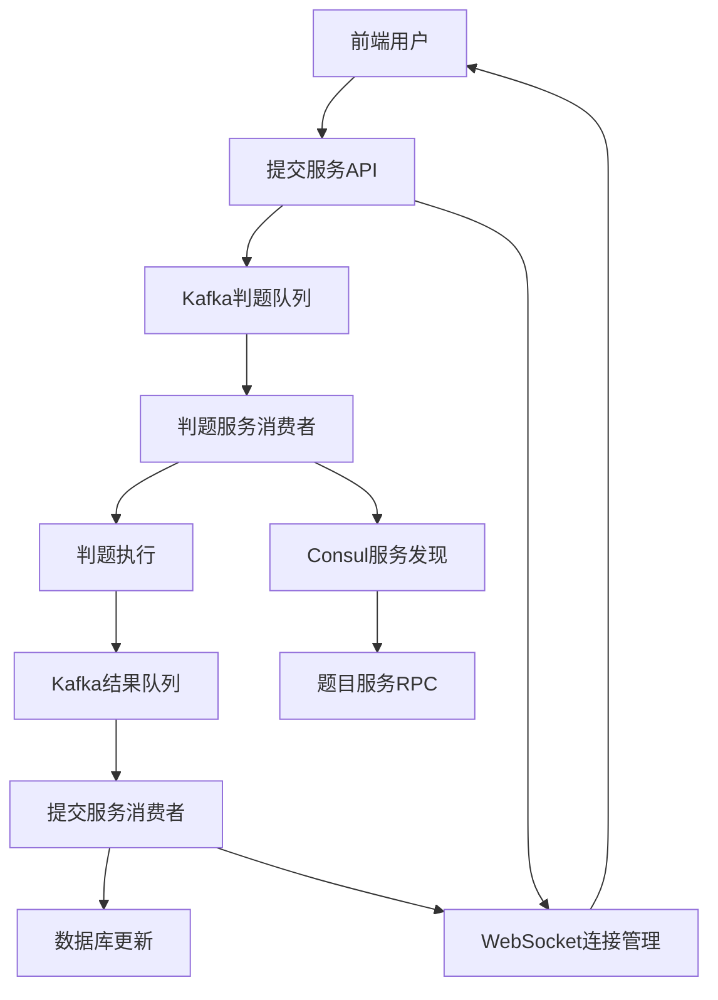

# WebSocket 实时推送和 Consul RPC 服务调用指南

本文档介绍了新增的 WebSocket 实时推送功能和基于 Consul 的 RPC 服务调用机制。

## 目录

1. [功能概述](#功能概述)
2. [WebSocket 实时推送](#websocket-实时推送)
3. [Consul RPC 服务调用](#consul-rpc-服务调用)
4. [配置说明](#配置说明)
5. [部署指南](#部署指南)
6. [测试指南](#测试指南)
7. [故障排除](#故障排除)

## 功能概述

### 主要改进

1. **异步 WebSocket 通知**: 实现了基于 Kafka 消息队列的异步 WebSocket 推送，用户可以实时接收判题结果和状态更新。

2. **Consul 服务治理**: 引入了 Consul 作为服务注册发现中心，实现了基于 RPC 的服务间调用，替代了原有的直接 HTTP 调用。

3. **完整的异步流程**: 实现了从任务提交到结果推送的完整异步处理链路。

### 架构改进



## WebSocket 实时推送

### 功能特性

- **实时连接**: 用户建立 WebSocket 连接后可实时接收推送
- **身份验证**: 基于 JWT 的连接认证
- **消息类型**: 支持判题结果、状态更新、系统通知等多种消息类型
- **连接管理**: 自动心跳检测、重连机制、优雅断开

### 使用方式

#### 1. 建立 WebSocket 连接

```javascript
// 在WebSocket URL中包含JWT token
const wsUrl = `ws://localhost:8888/ws?token=${encodeURIComponent(jwtToken)}`;
const websocket = new WebSocket(wsUrl);

websocket.onopen = function(event) {
    console.log('WebSocket连接成功');
};

websocket.onmessage = function(event) {
    const data = JSON.parse(event.data);
    handleMessage(data);
};
```

#### 2. 处理消息类型

```javascript
function handleMessage(data) {
    switch (data.type) {
        case 'welcome':
            console.log('欢迎消息:', data.data);
            break;
            
        case 'judge_result':
            console.log('判题结果:', data.data);
            // 更新UI显示判题结果
            updateJudgeResult(data.data);
            break;
            
        case 'status_update':
            console.log('状态更新:', data.data);
            // 更新进度条
            updateProgress(data.data.progress);
            break;
    }
}
```

#### 3. 消息格式

**判题结果消息**:
```json
{
    "type": "judge_result",
    "submission_id": 123,
    "user_id": 1,
    "data": {
        "submission_id": 123,
        "status": "accepted",
        "result": {
            "verdict": "Accepted",
            "score": 100,
            "time_used": 120,
            "memory_used": 1024,
            "test_cases": [...]
        },
        "timestamp": 1699123456789
    },
    "timestamp": "2023-11-05T10:30:45Z"
}
```

**状态更新消息**:
```json
{
    "type": "status_update",
    "submission_id": 123,
    "user_id": 1,
    "data": {
        "submission_id": 123,
        "status": "judging",
        "progress": 60,
        "message": "正在执行测试用例",
        "timestamp": 1699123456789
    },
    "timestamp": "2023-11-05T10:30:45Z"
}
```

## Consul RPC 服务调用

### 功能特性

- **服务发现**: 自动发现和管理服务实例
- **负载均衡**: 支持轮询、随机等负载均衡策略
- **健康检查**: 定期检查服务健康状态
- **断路器**: 防止服务雪崩的熔断机制
- **重试机制**: 自动重试失败的调用

### 配置说明

#### 1. Consul 配置

```yaml
Consul:
  Enabled: true
  Address: "localhost:8500"
  ServiceName: "submission-api"
  ServiceID: "submission-api-1"
  HealthCheckURL: "http://localhost:8888/health"
  HealthInterval: "10s"
  HealthTimeout: "3s"
  DeregisterAfter: "30s"
  Tags:
    - "submission"
    - "api"
    - "v1"
```

#### 2. RPC 配置

```yaml
RPC:
  Enabled: true
  DefaultTimeout: 10s
  MaxRetries: 2
  RetryDelay: 500ms
```

### 服务调用示例

#### 1. 判题服务调用

```go
// 创建判题服务RPC客户端
judgeClient, err := client.NewJudgeRPCClient("localhost:8500", 10*time.Second)
if err != nil {
    return err
}

// 获取判题结果
result, err := judgeClient.GetJudgeResult(ctx, submissionID)
if err != nil {
    return err
}
```

#### 2. 题目服务调用

```go
// 创建题目服务RPC客户端
problemClient, err := client.NewProblemRPCClient("localhost:8500", 10*time.Second)
if err != nil {
    return err
}

// 获取题目信息
problem, err := problemClient.GetProblem(ctx, problemID)
if err != nil {
    return err
}
```

## 配置说明

### 完整配置文件

参考 `etc/submission-api-enhanced.yaml`:

```yaml
# Kafka配置 - 支持判题结果消费
KafkaConf:
  Brokers:
    - localhost:9094
  Topics:
    JudgeTask: "judge_tasks"
    JudgeResult: "judge_results"      # 新增
    StatusUpdate: "status_updates"    # 新增
    Notification: "notifications"
    DeadLetter: "dead_letters"        # 新增
  Groups:
    SubmissionResult: "submission_result_group"  # 新增
    StatusUpdate: "status_update_group"          # 新增

# WebSocket配置
WebSocket:
  ReadTimeout: 60
  WriteTimeout: 10
  HeartbeatInterval: 30
  MaxConnections: 1000
  BufferSize: 1024

# Consul配置
Consul:
  Enabled: true
  Address: "localhost:8500"
  ServiceName: "submission-api"
  ServiceID: "submission-api-1"
  HealthCheckURL: "http://localhost:8888/health"
  HealthInterval: "10s"
  HealthTimeout: "3s"
  DeregisterAfter: "30s"
  Tags:
    - "submission"
    - "api"
    - "v1"

# RPC配置
RPC:
  Enabled: true
  DefaultTimeout: 10s
  MaxRetries: 2
  RetryDelay: 500ms
```

## 部署指南

### 1. 环境要求

- Consul 1.15+
- Kafka 2.8+
- Go 1.21+
- MySQL 8.0+
- Redis 6.0+

### 2. 启动步骤

#### 启动基础服务

```bash
# 启动Consul
consul agent -dev

# 启动Kafka
kafka-server-start.sh config/server.properties

# 启动Redis
redis-server

# 启动MySQL
systemctl start mysql
```

#### 创建Kafka主题

```bash
kafka-topics.sh --create --topic judge_tasks --bootstrap-server localhost:9094
kafka-topics.sh --create --topic judge_results --bootstrap-server localhost:9094
kafka-topics.sh --create --topic status_updates --bootstrap-server localhost:9094
kafka-topics.sh --create --topic dead_letters --bootstrap-server localhost:9094
```

#### 启动应用服务

```bash
# 启动判题服务
cd services/judge-api
./judge-api -f etc/judge-api.yaml

# 启动题目服务
cd services/problem-api
./problem-api -f etc/problem-api.yaml

# 启动提交服务
cd services/submission-api
./submission-api -f etc/submission-api-enhanced.yaml
```

### 3. 验证部署

```bash
# 检查Consul服务注册
curl http://localhost:8500/v1/catalog/services

# 检查服务健康状态
curl http://localhost:8888/health

# 运行集成测试
./test/integration_test.sh
```

## 测试指南

### 1. WebSocket 测试

使用提供的测试页面：

```bash
# 打开测试页面
open test/websocket_test.html
```

或使用命令行工具：

```bash
# 安装wscat
npm install -g wscat

# 测试WebSocket连接
echo "test" | wscat -c "ws://localhost:8888/ws?token=YOUR_JWT_TOKEN"
```

### 2. RPC 调用测试

```bash
# 运行RPC测试程序
cd test
go run rpc_test.go
```

### 3. 集成测试

```bash
# 运行完整的集成测试
./test/integration_test.sh

# 运行特定测试
./test/integration_test.sh websocket  # 仅测试WebSocket
./test/integration_test.sh rpc        # 仅测试RPC
./test/integration_test.sh consul     # 仅测试Consul
```

### 4. 性能测试

```bash
# 并发连接测试
ab -n 1000 -c 50 http://localhost:8888/health

# WebSocket连接压测
# 使用专门的WebSocket压测工具
```

## 故障排除

### 常见问题

#### 1. WebSocket 连接失败

**问题**: 无法建立WebSocket连接
**解决方案**:
- 检查JWT token是否有效
- 确认服务端口是否正确
- 查看防火墙设置

```bash
# 检查端口是否开放
netstat -tlnp | grep 8888

# 测试基本连接
curl http://localhost:8888/health
```

#### 2. Consul 服务注册失败

**问题**: 服务无法注册到Consul
**解决方案**:
- 检查Consul是否运行
- 验证配置文件中的Consul地址
- 查看健康检查URL是否可访问

```bash
# 检查Consul状态
consul members

# 查看服务注册情况
curl http://localhost:8500/v1/catalog/services
```

#### 3. RPC 调用超时

**问题**: RPC调用经常超时
**解决方案**:
- 增加超时时间配置
- 检查网络连接
- 验证目标服务是否正常运行

```bash
# 检查服务健康状态
curl http://localhost:8500/v1/health/service/judge-api
```

#### 4. Kafka 消息消费失败

**问题**: 判题结果无法通过WebSocket推送
**解决方案**:
- 检查Kafka连接
- 验证主题是否存在
- 查看消费者组状态

```bash
# 检查Kafka主题
kafka-topics.sh --list --bootstrap-server localhost:9094

# 查看消费者组状态
kafka-consumer-groups.sh --bootstrap-server localhost:9094 --list
```

### 日志分析

#### 关键日志位置

```bash
# 提交服务日志
tail -f services/submission-api/logs/submission-api/access.log
tail -f services/submission-api/logs/submission-api/error.log

# 判题服务日志
tail -f services/judge-api/logs/judge-api/access.log

# Consul日志
consul monitor
```

#### 日志关键字

- `WebSocket连接注册成功`: WebSocket连接建立
- `RPC调用成功`: RPC调用完成
- `Kafka消息已提交`: 消息队列发送成功
- `服务已注册到Consul`: Consul注册成功

### 监控指标

#### 重要指标

1. **WebSocket连接数**: 当前活跃的WebSocket连接
2. **RPC调用成功率**: RPC调用的成功率和响应时间
3. **Kafka消息积压**: 消息队列中待处理的消息数量
4. **服务健康状态**: 各服务的健康检查状态

#### 查看指标

```bash
# WebSocket连接数
curl http://localhost:8888/health | jq '.services.websocket.connections'

# 服务健康状态
curl http://localhost:8888/health | jq '.services'
```

## 总结

通过引入 WebSocket 实时推送和 Consul RPC 服务调用，系统实现了：

1. **实时性提升**: 用户可以实时接收判题结果，无需轮询
2. **系统解耦**: 基于消息队列的异步处理，提高了系统的可靠性
3. **服务治理**: 通过Consul实现了服务的自动发现和负载均衡
4. **可扩展性**: 支持水平扩展和微服务架构

这些改进显著提升了系统的用户体验、性能和可维护性。


