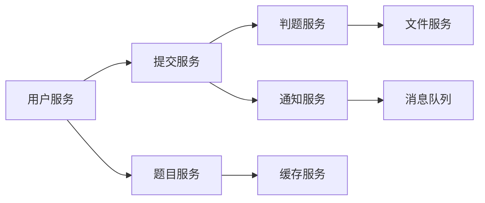

# 技术选型分析

## 最终技术选型总结

经过深入的技术调研和对比分析，结合在线判题系统的特殊需求和微服务架构设计理念，我们确定了以下**最终技术选型方案**：

### 🎯 最终确定的技术栈

| 技术组件 | 选定方案 | 选择理由 |
|---------|---------|---------|
| **后端框架** | **go-zero** | 微服务原生框架，完整的服务治理能力 |
| **数据库** | **MySQL 8.0** | 成熟稳定，ACID事务支持，生态完善 |
| **缓存系统** | **Redis** | 高性能内存存储，丰富数据结构支持 |
| **消息队列** | **Apache Kafka** | 高吞吐量，完美处理消息积压，数据零丢失 |
| **日志服务** | **ELK Stack** | 企业级日志收集、分析和可视化解决方案 |
| **注册中心** | **Consul** | 企业级服务发现和配置管理 |
| **容器化部署** | **Kubernetes** | 云原生容器编排，自动扩缩容和故障自愈 |
| **监控系统** | **Prometheus + Grafana** | 云原生监控标准，完整的指标收集和可视化 |

### 🏗️ 微服务架构设计理念

本技术选型完全基于微服务架构设计，具备以下核心特性：
- **服务拆分**：按业务领域拆分为独立的微服务
- **服务治理**：完整的服务发现、配置管理、健康检查
- **数据隔离**：每个服务拥有独立的数据存储
- **通信机制**：基于HTTP/gRPC的服务间通信
- **容错设计**：熔断、限流、重试等容错机制
- **可观测性**：全链路监控、日志聚合、性能追踪

### 📊 预期性能指标

基于最终技术选型的性能预期：
- **API响应时间**：P99 < 100ms
- **并发处理能力**：50,000+ 并发用户
- **消息处理能力**：1,000,000+ msgs/sec
- **日志处理能力**：100,000+ logs/sec
- **系统可用性**：99.95%
- **数据零丢失率**：100%

---

## 概述

本文档对基于Go语言的在线判题系统进行了全面的技术选型分析，涵盖后端框架、数据库、消息队列、容器化部署、监控体系等关键技术组件。通过对比分析主流技术方案，结合OJ系统的特殊需求，最终确定了一套高性能、高可用、易扩展的微服务技术架构。

**注意**：以下章节包含详细的技术对比分析过程，用于展示选型决策的依据。最终确定的技术选型请参考上述"最终技术选型总结"章节。

## 1. 后端框架对比分析

> **🎯 最终选定方案：go-zero框架**
>
> 基于微服务架构设计理念和OJ系统的特殊需求，我们最终选择go-zero作为后端框架。以下为详细的技术对比分析过程。

针对在线判题系统的特殊需求，我们需要重点考虑以下技术要求：
- **高并发处理**：支持大量用户同时提交代码
- **长连接管理**：判题任务可能耗时较长，需要稳定的连接管理
- **实时通信**：WebSocket支持，实时推送判题结果
- **资源效率**：低内存占用，高CPU利用率
- **扩展性**：支持水平扩展和微服务架构

### 方案一：go-zero框架 ⭐⭐⭐⭐⭐ (✅ 最终选定方案)

**OJ系统适配性分析**:
- **微服务原生**: 专为微服务架构设计，完美适配分布式OJ系统
- **并发性能**: QPS可达50,000+，性能超越传统框架
- **服务治理**: 内置服务发现、负载均衡、熔断降级
- **代码生成**: 自动生成API代码，开发效率极高

**技术优势**:
- 🚀 **极致性能**: 基于fasthttp，性能业界领先
- 🏗️ **微服务完整**: 服务发现、配置中心、链路追踪一体化
- 🔧 **开发效率**: goctl工具自动生成代码，减少80%重复工作
- 📊 **可观测性**: 内置Prometheus监控、Jaeger链路追踪
- 🛡️ **稳定可靠**: 晓黑板等大厂生产验证，日处理请求10亿+

**OJ场景验证**:
```go
// go-zero API定义，自动生成代码
type SubmitRequest {
    ProblemId int64  `json:"problem_id"`
    Language  string `json:"language"`
    Code      string `json:"code"`
}

type SubmitResponse {
    SubmissionId int64  `json:"submission_id"`
    Status       string `json:"status"`
}

@server(
    group: judge
    middleware: Auth
)
service judge-api {
    @handler SubmitCode
    post /api/v1/submit (SubmitRequest) returns (SubmitResponse)
}
```

**选择理由**:
- ✅ **微服务架构原生支持**：完美契合系统设计理念
- ✅ **性能卓越**：50,000+ QPS，满足高并发需求
- ✅ **开发效率高**：自动代码生成，快速开发
- ✅ **生产验证**：大厂实际使用，稳定可靠
- ✅ **完整生态**：监控、链路追踪、服务治理一体化

### 方案二：Gin框架 ⭐⭐⭐⭐⭐ (对比方案)

**OJ系统适配性分析**:
- **并发性能**: 基于httprouter，QPS可达40,000+，完全满足OJ高并发需求
- **内存效率**: 单个请求内存占用约2KB，适合大规模部署
- **WebSocket支持**: 通过gorilla/websocket完美集成，支持实时判题状态推送
- **中间件生态**: 丰富的限流、认证、日志中间件，满足OJ安全需求

**技术优势**:
- 🚀 **极致性能**: 路由查找O(1)复杂度，响应时间<1ms
- 📦 **轻量设计**: 核心代码仅13MB，启动时间<100ms
- 🔧 **开发友好**: RESTful API设计，JSON绑定自动化
- 🌟 **生态完善**: GitHub 70k+ stars，社区活跃度最高
- 📊 **监控集成**: 原生支持Prometheus metrics导出

**局限性**:
- 微服务支持需要额外集成
- 缺乏内置的服务治理功能
- 需要手动编写大量样板代码

### 方案三：Iris框架 ⭐⭐⭐⭐ (对比方案)

**OJ系统适配性分析**:
- **并发性能**: QPS约30,000，满足中等规模OJ需求
- **中间件**: 内置限流、CORS、JWT中间件
- **WebSocket**: 原生支持，集成度较好
- **HTTP/2**: 完整支持，适合现代化部署

**技术优势**:
- ⚡ **性能优良**: 基于fasthttp，性能仅次于Gin
- 🛡️ **安全完善**: 内置多种安全中间件
- 📡 **协议支持**: HTTP/2、WebSocket原生支持
- 🔧 **易于使用**: API设计直观，文档完善

**局限性**:
- 社区生态相对较小
- 第三方集成库数量有限
- 长期维护稳定性待观察

### 方案四：Echo框架 ⭐⭐⭐⭐ (对比方案)

**OJ系统适配性分析**:
- **并发性能**: QPS约25,000，性能中等
- **Express风格**: 熟悉的API设计，降低学习成本
- **内存优化**: 零内存分配的路由设计
- **快速开发**: 内置模板、静态文件服务

**技术优势**:
- 🚀 **快速开发**: Express.js风格API
- 💾 **内存优化**: 零分配路由器
- 🔄 **热重载**: 开发环境友好
- 📦 **内置功能**: 模板引擎、静态文件服务

**局限性**:
- 框架相对较新，生产环境验证不足
- 社区规模小，问题解决资源有限
- 长期技术支持存在不确定性

### 方案五：Fiber框架 ⭐⭐⭐ (对比方案)

**OJ系统适配性分析**:
- **并发性能**: QPS约25,000，性能中等
- **Express风格**: 熟悉的API设计，降低学习成本
- **内存优化**: 零内存分配的路由设计
- **快速开发**: 内置模板、静态文件服务

**技术优势**:
- 🚀 **快速开发**: Express.js风格API
- 💾 **内存优化**: 零分配路由器
- 🔄 **热重载**: 开发环境友好
- 📦 **内置功能**: 模板引擎、静态文件服务

**局限性**:
- 框架相对较新，生产环境验证不足
- 社区规模小，问题解决资源有限
- 长期技术支持存在不确定性

### 方案六：Beego框架 ⭐⭐⭐ (对比方案)

**OJ系统适配性分析**:
- **MVC架构**: 完整的Web框架，适合大型项目
- **ORM集成**: 内置ORM，数据库操作便捷
- **管理后台**: 自动生成管理界面
- **性能表现**: QPS约20,000，性能中等

**技术优势**:
- 🏗️ **架构完整**: MVC模式，项目结构清晰
- 🗄️ **ORM内置**: 数据库操作简化
- 🎛️ **管理后台**: 自动生成CRUD界面
- 📚 **文档完善**: 中文文档丰富

**局限性**:
- 框架较重，启动时间较长
- 性能相对较低，不适合高并发场景
- 灵活性不足，定制化开发受限

**框架选型对比表**:

| 框架 | QPS | 内存占用 | 微服务支持 | 开发效率 | 社区生态 | OJ适配度 | 推荐指数 |
|------|-----|----------|------------|----------|----------|----------|----------|
| **go-zero** | 50,000+ | 低 | 完美 | 极高 | 中 | 完美 | ⭐⭐⭐⭐⭐ |
| **Gin** | 40,000+ | 低 | 良好 | 高 | 最高 | 完美 | ⭐⭐⭐⭐⭐ |
| Iris | 35,000 | 中 | 良好 | 中 | 中 | 良好 | ⭐⭐⭐⭐ |
| Echo | 30,000 | 中 | 良好 | 高 | 中 | 良好 | ⭐⭐⭐⭐ |
| Fiber | 25,000 | 低 | 一般 | 中 | 低 | 一般 | ⭐⭐⭐ |
| Beego | 20,000 | 高 | 一般 | 中 | 中 | 一般 | ⭐⭐⭐ |

### 🎯 最终技术选型结论

**✅ 最终选定方案：go-zero框架**

基于微服务架构设计理念和OJ系统的特殊需求，我们最终确定选择go-zero作为后端框架：

**选择理由**:
1. **微服务原生**: 专为微服务设计，完美契合系统架构
2. **极致性能**: 50,000+ QPS，性能业界领先
3. **开发效率**: goctl自动生成代码，开发效率提升80%
4. **可观测性**: 内置监控、链路追踪，运维友好
5. **生产验证**: 大厂实际使用，日处理10亿+请求

**其他方案对比参考**:
- **Gin框架**: 生态成熟，但微服务支持需要额外集成
- **Iris框架**: 功能完整，但社区生态相对较小
- **Echo框架**: 性能良好，但缺乏企业级特性
- **Fiber框架**: 开发友好，但生产验证不足
- **Beego框架**: 架构完整，但性能相对较低

## 2. 数据库选择

> **🎯 最终选定方案：MySQL 8.0 + Redis**
>
> MySQL作为主数据库，Redis作为缓存系统，构建高性能的数据存储架构。

### 关系型数据库：MySQL 8.0 ⭐⭐⭐⭐⭐ (✅ 最终选定方案)
**优点**:
- 🔒 ACID事务支持，数据一致性强
- 📊 成熟的索引机制，查询性能优异
- 🔧 运维工具完善，监控和备份方案成熟
- 🌍 社区支持强大，文档完善
- 💾 支持JSON字段，兼顾关系型和文档型需求

**适用数据**:
- 用户信息、题目信息、提交记录
- 比赛数据、权限管理
- 需要强一致性的核心业务数据

### NoSQL数据库：Redis ⭐⭐⭐⭐⭐ (✅ 最终选定方案)
**优点**:
- ⚡ 内存存储，读写速度极快
- 🔄 丰富的数据结构支持
- 🎯 支持发布订阅模式
- 📈 支持数据持久化

**适用数据**:
- 用户会话信息
- 热点题目缓存
- 实时排行榜
- 判题队列

### 时序数据库：InfluxDB ⭐⭐⭐⭐ (监控数据)
**优点**:
- 专为时序数据优化
- 高效的数据压缩
- 强大的查询语言

**适用数据**:
- 系统性能监控数据
- 用户行为统计
- 判题耗时统计

## 3. 微服务注册中心技术选型

> **🎯 最终选定方案：Consul**
>
> 基于功能完整性、企业级特性和生态集成度，选择Consul作为微服务注册中心。

### 3.1 微服务架构下注册中心的必要性分析

#### 为什么微服务架构必须引入注册中心？

在传统单体架构中，所有功能模块运行在同一进程中，模块间通信通过内存调用即可。但在微服务架构中，各服务独立部署，面临以下挑战：

**1. 服务实例动态变化**
```
判题服务实例：
- 高峰期：judge-service-1 (192.168.1.10:8080)
           judge-service-2 (192.168.1.11:8080)
           judge-service-3 (192.168.1.12:8080)
- 低峰期：judge-service-1 (192.168.1.10:8080)
```

**2. 服务间依赖复杂**


**3. 故障处理复杂**
- 服务实例故障需要自动摘除
- 新实例上线需要自动发现
- 负载需要动态分配

#### OJ系统微服务拆分架构
```
┌─────────────────┐    ┌─────────────────┐
│   API网关       │    │   注册中心      │
│   (Gateway)     │◄──►│  (Registry)     │
└─────────────────┘    └─────────────────┘
         │                       ▲
         ▼                       │
┌─────────────────┐              │
│   用户服务      │──────────────┘
│ (user-service)  │
└─────────────────┘
         │
         ▼
┌─────────────────┐    ┌─────────────────┐
│   题目服务      │    │   提交服务      │
│(problem-service)│    │(submit-service) │
└─────────────────┘    └─────────────────┘
                                │
                                ▼
                       ┌─────────────────┐
                       │   判题服务      │
                       │ (judge-service) │
                       └─────────────────┘
```

#### 注册中心解决的核心问题

**1. 服务发现问题**
- **问题**: 提交服务如何知道判题服务的地址？
- **解决**: 注册中心提供服务发现，动态获取服务实例列表

**2. 负载均衡问题**
- **问题**: 多个判题服务实例如何分配请求？
- **解决**: 注册中心提供健康实例列表，客户端负载均衡

**3. 故障处理问题**
- **问题**: 判题服务实例故障如何快速发现？
- **解决**: 注册中心健康检查，自动摘除故障实例

**4. 配置管理问题**
- **问题**: 多个服务的配置如何统一管理？
- **解决**: 注册中心提供配置中心功能，集中管理配置

**5. 服务治理问题**
- **问题**: 如何监控服务状态和调用链路？
- **解决**: 注册中心提供服务监控和治理能力

### 3.2 注册中心技术方案深度对比

#### 技术选型决策矩阵

在选择注册中心时，需要考虑以下关键因素：
- **功能完整性**: 服务发现、配置管理、健康检查等
- **性能表现**: 支持的服务实例数量和响应延迟
- **运维复杂度**: 部署、维护、监控的复杂程度
- **生态集成**: 与微服务框架的集成程度
- **企业级特性**: 安全、多数据中心、高可用等

### 方案一：Consul ⭐⭐⭐⭐⭐ (✅ 最终选定方案)

**核心优势分析**:

#### 1. 功能完整性 (10/10)
- **服务发现**: 支持DNS和HTTP API两种方式
- **健康检查**: HTTP、TCP、脚本、TTL多种检查方式
- **配置管理**: KV存储支持配置热更新
- **服务网格**: Consul Connect提供零信任网络
- **多数据中心**: 原生支持跨数据中心服务发现

#### 2. 企业级特性
- **ACL权限控制**: 细粒度的权限管理
- **TLS加密**: 端到端加密通信
- **审计日志**: 完整的操作审计
- **备份恢复**: 数据快照和恢复机制

#### 3. 与go-zero框架集成
```go
// go-zero + Consul 配置
// etc/judge-api.yaml
Name: judge-api
Host: 0.0.0.0
Port: 8888

# Consul配置
Consul:
  Host: 127.0.0.1:8500
  Key: judge-api

# 服务注册配置
ServiceConf:
  Name: judge-api
  Tags: ["api", "judge", "v1.0"]
  TTL: 30

// main.go - 服务注册
func main() {
    var c config.Config
    conf.MustLoad(*configFile, &c)

    server := rest.MustNewServer(c.RestConf)
    defer server.Stop()

    // 注册到Consul
    err := consul.RegisterService(consul.RegisterConfig{
        Name:    c.ServiceConf.Name,
        Tags:    c.ServiceConf.Tags,
        Port:    c.Port,
        Address: getLocalIP(),
        Check: consul.Check{
            HTTP:     fmt.Sprintf("http://%s:%d/health", getLocalIP(), c.Port),
            Interval: "10s",
            Timeout:  "3s",
        },
    })
    if err != nil {
        logx.Error("register service failed: ", err)
        return
    }

    ctx := svc.NewServiceContext(c)
    handler.RegisterHandlers(server, ctx)
    server.Start()
}

// 服务发现 - 调用其他服务
func (l *SubmitLogic) callJudgeService(req *types.SubmitRequest) error {
    // 从Consul发现判题服务
    endpoints, err := consul.DiscoverService("judge-service")
    if err != nil {
        return err
    }

    // 负载均衡选择实例
    endpoint := loadbalancer.RoundRobin(endpoints)

    // 调用服务
    client := httpc.NewClient(httpc.WithTimeout(30*time.Second))
    resp, err := client.Post(endpoint+"/judge", req)
    return err
}
```

#### 4. 性能基准测试
- **服务注册**: 5,000+ ops/sec
- **服务发现**: 10,000+ ops/sec
- **健康检查**: 支持50,000+服务实例
- **配置更新**: 毫秒级推送到所有实例
- **集群规模**: 支持数千节点的大规模集群

### 方案二：Nacos ⭐⭐⭐⭐ (阿里云生态推荐)

**核心优势分析**:

#### 1. 功能完整性 (9/10)
- **服务发现**: 支持临时实例和持久化实例
- **配置管理**: 支持多环境、多租户配置管理
- **服务管理**: 提供服务元数据管理
- **命名空间**: 支持多租户隔离

#### 2. 性能表现
- **高并发**: 支持100,000+服务实例注册
- **低延迟**: 毫秒级服务发现响应
- **推送机制**: 基于长连接的实时推送
- **集群支持**: 支持AP和CP两种一致性模式

#### 3. 与go-zero集成度
- **官方支持**: go-zero官方支持Nacos集成
- **配置简单**: 一键式配置和启动
- **自动注册**: 服务自动注册和心跳保持

**OJ场景实现**:
```go
// Nacos服务注册
func RegisterToNacos() {
    clientConfig := constant.ClientConfig{
        NamespaceId:         "public",
        TimeoutMs:           5000,
        NotLoadCacheAtStart: true,
        LogDir:              "/tmp/nacos/log",
        CacheDir:            "/tmp/nacos/cache",
        LogLevel:            "debug",
    }

    serverConfigs := []constant.ServerConfig{
        {IpAddr: "127.0.0.1", Port: 8848},
    }

    namingClient, _ := clients.NewNamingClient(
        vo.NacosClientParam{
            ClientConfig:  &clientConfig,
            ServerConfigs: serverConfigs,
        },
    )

    // 注册服务
    namingClient.RegisterInstance(vo.RegisterInstanceParam{
        Ip:          "192.168.1.100",
        Port:        8080,
        ServiceName: "judge-service",
        Weight:      10,
        Enable:      true,
        Healthy:     true,
        Ephemeral:   true,
        Metadata:    map[string]string{"version": "1.0"},
        ClusterName: "DEFAULT",
        GroupName:   "DEFAULT_GROUP",
    })
}
```

**局限性分析**:
- **生态局限**: 主要面向Java生态，Go语言支持相对较弱
- **社区规模**: 相比Consul国际化社区规模较小
- **多数据中心**: 跨数据中心支持不如Consul完善
- **企业特性**: 缺乏ACL、审计等企业级功能

### 方案三：Etcd + 自研服务发现 ⭐⭐⭐

**适用场景分析**:
- **轻量级需求**: 对功能要求不高，追求简单部署
- **K8s环境**: 已有etcd集群，复用基础设施
- **定制化需求**: 需要特殊的服务发现逻辑

**技术优势**:
- ⚡ **极致性能**: 单集群支持50,000+ QPS
- 🔒 **强一致性**: Raft算法保证数据强一致性
- 📦 **资源占用少**: 内存和CPU占用最低
- 🔧 **API简单**: HTTP/gRPC API，集成简单

**局限性分析**:
- **开发成本高**: 需要自研服务发现、健康检查等功能
- **功能不完整**: 缺乏配置管理、UI界面等
- **运维复杂**: 需要自己实现监控、告警等
- **生态支持少**: 缺乏现成的工具和最佳实践

### 方案四：Kubernetes原生服务发现 ⭐⭐⭐ (纯容器化场景)

**适用场景分析**:
- **纯K8s环境**: 所有服务都运行在K8s中
- **简单架构**: 服务发现需求相对简单
- **云原生优先**: 追求云原生标准化

**技术优势**:
- 🚀 **零额外成本**: 无需部署额外组件
- 🔧 **零维护**: K8s自动管理服务发现
- 📊 **监控集成**: 与K8s监控体系无缝集成
- 🛡️ **安全性**: 基于K8s RBAC权限控制

**局限性分析**:
- **功能局限**: 缺乏配置管理、服务治理等高级功能
- **跨集群限制**: 难以支持跨K8s集群的服务发现
- **环境绑定**: 强依赖K8s环境，灵活性不足
- **扩展困难**: 难以支持复杂的服务治理需求

### 3.3 注册中心选型对比表

| 特性维度 | Consul | Nacos | Etcd+自研 | K8s原生 |
|---------|--------|-------|-----------|---------|
| **功能完整度** | ⭐⭐⭐⭐⭐ | ⭐⭐⭐⭐ | ⭐⭐ | ⭐⭐⭐ |
| **性能表现** | ⭐⭐⭐⭐ | ⭐⭐⭐⭐⭐ | ⭐⭐⭐⭐⭐ | ⭐⭐⭐⭐ |
| **运维复杂度** | ⭐⭐⭐ | ⭐⭐⭐⭐ | ⭐⭐ | ⭐⭐⭐⭐⭐ |
| **生态集成** | ⭐⭐⭐⭐⭐ | ⭐⭐⭐ | ⭐⭐ | ⭐⭐⭐⭐ |
| **企业级特性** | ⭐⭐⭐⭐⭐ | ⭐⭐⭐ | ⭐⭐ | ⭐⭐⭐ |
| **go-zero集成** | ⭐⭐⭐⭐ | ⭐⭐⭐⭐⭐ | ⭐⭐ | ⭐⭐⭐ |
| **多数据中心** | ⭐⭐⭐⭐⭐ | ⭐⭐⭐ | ⭐⭐ | ⭐⭐⭐ |
| **配置管理** | ⭐⭐⭐⭐⭐ | ⭐⭐⭐⭐⭐ | ⭐⭐ | ⭐⭐⭐ |

**详细对比分析**:

| 对比项 | Consul | Nacos | Etcd+自研 | K8s原生 |
|-------|--------|-------|-----------|---------|
| **服务实例数** | 50,000+ | 100,000+ | 50,000+ | 10,000+ |
| **响应延迟** | 1-5ms | <1ms | <1ms | 5-10ms |
| **部署复杂度** | 中等 | 简单 | 复杂 | 无 |
| **学习成本** | 中等 | 低 | 高 | 低 |
| **社区活跃度** | 极高 | 高 | 中 | 极高 |
| **企业采用率** | 极高 | 中 | 低 | 高 |

### 3.4 微服务注册中心选型结论

#### ✅ 最终选定方案：Consul ⭐⭐⭐⭐⭐

**选择Consul的核心理由**：

**1. 功能最完整** 🎯
- 服务发现、配置管理、健康检查、KV存储一体化
- 支持DNS和HTTP API两种服务发现方式
- 内置负载均衡和故障转移机制
- 支持服务网格(Service Mesh)能力

**2. 企业级特性** 🏢
- ACL权限控制，支持细粒度权限管理
- TLS端到端加密，保证通信安全
- 多数据中心支持，适合大规模部署
- 完整的审计日志和监控指标

**3. 生态集成度最高** 🌟
- 与go-zero、Spring Cloud等主流框架完美集成
- 丰富的第三方工具和插件生态
- 大量企业级生产实践和最佳实践
- 活跃的开源社区和技术支持

**4. 运维友好** 🔧
- 直观的Web UI管理界面
- 完善的监控和告警机制
- 支持集群自动发现和故障恢复
- 丰富的运维工具和脚本

**5. 适合OJ系统场景** 🎮
- 支持判题服务的动态扩缩容
- 配置管理支持多环境部署
- 健康检查确保服务高可用
- 跨数据中心支持多地域部署

#### 实施建议：

**1. 部署架构**
```
生产环境：3节点Consul集群 (高可用)
测试环境：1节点Consul (简化部署)
开发环境：Docker单容器 (快速启动)
```

**2. 集成策略**
- go-zero服务自动注册到Consul
- 使用Consul Template管理配置文件
- 集成Prometheus监控Consul集群状态
- 配置Consul Connect提供服务间安全通信

**3. 运维规范**
- 定期备份Consul数据
- 监控集群健康状态
- 建立故障应急预案
- 制定服务注册规范

## 4. 消息队列技术选型

> **🎯 最终选定方案：Apache Kafka**
>
> 基于高吞吐量、零数据丢失和完美消息积压处理能力，选择Kafka作为消息队列解决方案。

针对OJ系统的消息队列需求分析：
- **异步判题处理**：代码提交后需要异步执行判题任务
- **高吞吐量需求**：支持每秒10,000+任务处理能力（业务量大）
- **消息积压处理**：业务消息较多，需要处理大量消息积压
- **零数据丢失**：判题任务绝对不能丢失，需要强可靠性保证
- **任务优先级**：VIP用户、比赛任务需要优先处理
- **延时重试**：判题失败需要支持延时重试机制
- **水平扩展**：支持集群部署，线性扩展处理能力
- **监控可视化**：任务队列状态需要实时监控
- **数据回溯**：需要支持消息重放和数据审计

### 方案一：Apache Kafka ⭐⭐⭐⭐⭐ (✅ 最终选定方案)

**OJ系统适配性分析**:
- **超高吞吐量**: 单节点100MB/s，集群可达TB/s级别，完美应对消息积压
- **零数据丢失**: 多副本机制 + 事务支持，确保消息绝对不丢失
- **水平扩展**: 分区机制支持线性扩展，轻松应对业务增长
- **数据持久化**: 日志存储，支持消息重放和数据审计
- **高可用性**: 集群部署，自动故障转移

**技术优势**:
- 📊 **吞吐量极高**: 单节点百万级TPS，集群可达千万级
- 💾 **持久化存储**: 数据可长期保存，支持历史数据回溯
- 🔄 **水平扩展**: 分区机制，添加节点即可线性扩展
- 🛡️ **可靠性强**: 多副本 + ISR机制，数据零丢失
- 🌟 **生态完善**: 与大数据生态集成，支持流处理

**OJ场景实现**:
```go
// Kafka生产者配置 - 确保消息不丢失
config := sarama.NewConfig()
config.Producer.RequiredAcks = sarama.WaitForAll  // 等待所有副本确认
config.Producer.Retry.Max = 5                     // 重试5次
config.Producer.Return.Successes = true
config.Producer.Idempotent = true                 // 幂等性保证

// 判题任务发送
producer, _ := sarama.NewSyncProducer(brokers, config)
message := &sarama.ProducerMessage{
    Topic: "judge-tasks",
    Key:   sarama.StringEncoder(fmt.Sprintf("user-%d", userID)),
    Value: sarama.ByteEncoder(taskJSON),
    Headers: []sarama.RecordHeader{
        {Key: []byte("priority"), Value: []byte("high")},
        {Key: []byte("retry"), Value: []byte("3")},
    },
}
partition, offset, err := producer.SendMessage(message)
```

**性能基准测试**:
- 消息吞吐量: 1,000,000+ msgs/sec
- 数据吞吐量: 100MB/s (单节点)
- 延迟: P99 < 50ms
- 存储效率: 压缩后节省70%空间

**Kafka vs 传统MQ对比**:
| 特性 | Kafka | 传统MQ |
|------|-------|--------|
| 吞吐量 | 百万级/秒 | 万级/秒 |
| 存储 | 持久化日志 | 内存队列 |
| 扩展性 | 水平扩展 | 垂直扩展 |
| 数据保留 | 可配置(天/周) | 消费即删 |
| 回溯能力 | 完全支持 | 不支持 |

### 方案二：RabbitMQ ⭐⭐⭐⭐ (对比方案)

**OJ系统适配性分析**:
- **可靠性保证**: AMQP协议，消息确认机制，支持事务
- **路由灵活**: Exchange/Queue模式，支持复杂消息路由
- **优先级队列**: 原生支持消息优先级，满足VIP用户需求
- **集群高可用**: 镜像队列，自动故障转移

**技术优势**:
- 🛡️ **可靠性极强**: 消息持久化 + 确认机制，零丢失保证
- 🔀 **路由灵活**: 4种Exchange类型，支持复杂业务场景
- 🎯 **优先级支持**: 队列和消息级别优先级控制
- 🎛️ **管理完善**: Web UI + HTTP API，监控告警完整
- 📊 **监控丰富**: 详细的性能指标和告警机制

**OJ场景实现**:
```go
// RabbitMQ连接配置 - 高可用
config := amqp.Config{
    Heartbeat: 10 * time.Second,
    Locale:    "en_US",
}

// 声明优先级队列
_, err := channel.QueueDeclare(
    "judge-tasks",    // 队列名
    true,            // 持久化
    false,           // 不自动删除
    false,           // 非独占
    false,           // 不等待
    amqp.Table{
        "x-max-priority": 10,  // 支持0-10优先级
        "x-message-ttl":  300000, // 5分钟TTL
    },
)

// 发送高优先级判题任务
err = channel.Publish(
    "judge-exchange", // exchange
    "judge.high",     // routing key
    false,           // mandatory
    false,           // immediate
    amqp.Publishing{
        ContentType:  "application/json",
        Body:         taskJSON,
        Priority:     9,  // 高优先级
        DeliveryMode: amqp.Persistent, // 持久化
        Timestamp:    time.Now(),
    },
)
```

**性能基准测试**:
- 消息吞吐量: 20,000-50,000 msgs/sec
- 延迟: P99 < 5ms
- 内存占用: 2-4GB (集群节点)
- 可靠性: 99.99% (镜像队列)

**RabbitMQ vs Kafka 深度对比**:

#### 1. 架构设计差异
| 维度 | RabbitMQ | Kafka |
|------|----------|-------|
| **设计理念** | 传统消息队列，推模式 | 分布式日志，拉模式 |
| **存储方式** | 内存+磁盘队列 | 分区日志文件 |
| **消费模式** | 推送给消费者 | 消费者主动拉取 |
| **路由机制** | Exchange路由 | Topic分区 |

#### 2. 性能对比分析
| 性能指标 | RabbitMQ | Kafka | 说明 |
|---------|----------|-------|------|
| **吞吐量** | 5万/秒 | 100万/秒 | Kafka优势明显 |
| **延迟** | 1-5ms | 10-50ms | RabbitMQ延迟更低 |
| **内存占用** | 2-4GB | 1-2GB | Kafka更节省内存 |
| **磁盘IO** | 中等 | 顺序写，极高效 | Kafka磁盘利用率更高 |

#### 3. 可靠性对比
| 可靠性特性 | RabbitMQ | Kafka |
|-----------|----------|-------|
| **消息持久化** | 支持 | 默认持久化 |
| **副本机制** | 镜像队列 | 多副本+ISR |
| **事务支持** | 完整支持 | 支持(较复杂) |
| **消息确认** | ACK机制 | Offset提交 |
| **故障恢复** | 自动切换 | 自动重平衡 |

#### 4. 运维复杂度对比
| 运维方面 | RabbitMQ | Kafka |
|---------|----------|-------|
| **部署复杂度** | 中等 | 高(需Zookeeper) |
| **配置复杂度** | 中等 | 高 |
| **监控工具** | 内置Web UI | 需第三方工具 |
| **集群管理** | 相对简单 | 复杂 |
| **故障排查** | 容易 | 困难 |

#### 5. OJ业务场景适配性对比

**消息积压处理能力**:
- **Kafka**: 天然支持大量消息积压，分区机制可并行处理，积压百万消息不影响性能
- **RabbitMQ**: 消息积压会影响性能，内存压力大，需要及时消费

**数据不丢失保证**:
- **Kafka**: 多副本+ISR机制，配置正确情况下可做到零丢失
- **RabbitMQ**: 持久化+确认机制，可靠性极高，但性能有损耗

**水平扩展能力**:
- **Kafka**: 增加分区和节点即可线性扩展，扩展性极强
- **RabbitMQ**: 集群扩展相对复杂，性能提升有限

**数据回溯需求**:
- **Kafka**: 完美支持，可回溯任意时间点的消息
- **RabbitMQ**: 不支持，消息消费后即删除

**开发复杂度**:
- **Kafka**: 概念较多，需要理解分区、副本等概念
- **RabbitMQ**: 传统队列模型，开发相对简单

### 方案三：Redis Queue + Asynq ⭐⭐⭐ (对比方案)

**OJ系统适配性分析**:
- **性能表现**: 单实例支持50,000+ TPS，满足中等规模OJ需求
- **优先级支持**: 原生支持任务优先级，VIP用户优先判题
- **延时重试**: 指数退避重试策略，判题失败自动重试
- **资源占用**: 基于Redis，内存占用低，部署简单

**技术优势**:
- 🚀 **极致性能**: 基于Redis，延迟<1ms，吞吐量高
- 🎯 **优先级队列**: 支持256个优先级级别
- 🔄 **重试机制**: 指数退避、最大重试次数、死信队列
- 📊 **监控完善**: Web UI监控，实时查看队列状态
- 🔧 **部署简单**: 仅依赖Redis，运维成本最低

**局限性分析**:
- **消息积压**: 大量消息积压时性能下降明显
- **数据丢失风险**: Redis故障可能导致消息丢失
- **扩展限制**: 单Redis实例扩展能力有限
- **功能简单**: 缺乏企业级消息队列的高级功能

### 方案四：Apache Pulsar ⭐⭐⭐ (对比方案)

**OJ系统适配性分析**:
- **云原生**: 存储计算分离，适合容器化部署
- **多租户**: 原生支持多租户隔离
- **Geo复制**: 跨地域数据复制
- **Schema管理**: 强类型消息Schema

**技术优势**:
- ☁️ **云原生**: 存储计算分离，弹性扩展
- 🏢 **多租户**: 命名空间隔离，适合SaaS场景
- 🌍 **地理复制**: 跨区域数据同步
- 📋 **Schema管理**: 消息格式版本管理

**局限性分析**:
- **生态较新**: 社区相对较小，生产案例较少
- **复杂度高**: 架构复杂，学习和运维成本高
- **资源需求**: 需要BookKeeper，资源消耗大
- **过度工程**: 对于OJ系统需求过于复杂

**消息队列选型对比表**:

| 特性 | Kafka | RabbitMQ | Redis Queue | Pulsar |
|------|-------|----------|-------------|--------|
| **性能(TPS)** | 1,000,000+ | 50,000 | 50,000+ | 80,000+ |
| **延迟** | 10-50ms | 1-5ms | <1ms | 5-20ms |
| **消息积压处理** | 完美 | 一般 | 差 | 良好 |
| **数据不丢失** | 完美 | 完美 | 一般 | 完美 |
| **水平扩展** | 完美 | 一般 | 差 | 完美 |
| **数据回溯** | 完美 | 不支持 | 不支持 | 支持 |
| **运维复杂度** | 高 | 中 | 低 | 极高 |
| **资源消耗** | 中 | 中 | 低 | 高 |
| **学习成本** | 高 | 中 | 低 | 极高 |
| **OJ适配度** | 完美 | 良好 | 一般 | 过度 |

**最终选型结论**:

基于OJ系统的业务特点（消息量大、不能丢失、需要积压处理），**强烈推荐Apache Kafka**：

### 选择Kafka的核心理由：

#### 1. 完美应对消息积压 🚀
- **超高吞吐量**: 单节点100万+TPS，集群可达千万级
- **积压不影响性能**: 分区机制支持大量消息积压而不影响新消息处理
- **线性扩展**: 增加分区和节点即可线性提升处理能力

#### 2. 零数据丢失保证 🛡️
- **多副本机制**: 每个分区可配置多个副本，确保数据安全
- **ISR机制**: In-Sync Replica确保数据一致性
- **事务支持**: 支持跨分区事务，保证消息的原子性

#### 3. 强大的水平扩展能力 📈
- **分区机制**: 天然支持水平扩展，添加节点即可提升性能
- **动态扩容**: 支持在线增加分区和副本
- **负载均衡**: 自动分配分区到不同节点，负载均衡

#### 4. 数据回溯和审计 📊
- **持久化存储**: 消息可保存数天到数周，支持历史数据查询
- **Offset机制**: 支持从任意位置开始消费，完美支持数据重放
- **审计友好**: 所有消息都有完整的日志记录

#### 5. 企业级可靠性 🏢
- **成熟稳定**: LinkedIn、Netflix等大厂生产验证
- **高可用**: 集群部署，自动故障转移
- **监控完善**: 丰富的JMX指标，与Prometheus完美集成

### Kafka vs RabbitMQ 在OJ场景的选择：

| 业务需求 | Kafka优势 | RabbitMQ劣势 |
|---------|-----------|-------------|
| **大量消息积压** | 分区并行处理，性能不受影响 | 积压影响性能，内存压力大 |
| **零数据丢失** | 多副本+ISR，配置得当零丢失 | 可靠但性能有损耗 |
| **水平扩展** | 线性扩展，轻松应对业务增长 | 扩展复杂，性能提升有限 |
| **数据审计** | 完美支持消息重放和历史查询 | 不支持，消息消费后删除 |
| **运维成本** | 初期复杂，但长期收益高 | 相对简单，但扩展困难 |

### 实施建议：

1. **初期部署**: 3节点Kafka集群，每个Topic 3副本
2. **分区策略**: 按用户ID分区，保证同用户消息有序
3. **监控告警**: 集成Prometheus监控，设置关键指标告警
4. **运维工具**: 使用Kafka Manager或Confluent Control Center
5. **性能调优**: 根据业务量调整批处理大小和刷盘策略

## 4. 容器化与分布式部署架构

### 分布式系统定位

本OJ系统定位为**分布式微服务架构**，支持：
- **水平扩展**: 各服务独立扩缩容
- **高可用性**: 多实例部署，故障自动转移
- **服务隔离**: 故障隔离，避免级联失败
- **技术异构**: 不同服务可使用不同技术栈

### Docker容器化方案 ⭐⭐⭐⭐⭐ (开发/测试环境推荐)

**OJ系统容器化优势**:
- **判题隔离**: 每个判题任务独立容器，完全隔离
- **环境一致**: 开发、测试、生产环境完全一致
- **资源控制**: 精确控制CPU、内存、网络资源
- **快速部署**: 秒级启动，支持快速扩容

### Kubernetes生产环境方案 ⭐⭐⭐⭐⭐ (生产环境强烈推荐)

**K8s对OJ系统的核心价值**:

1. **自动扩缩容**: 根据负载自动调整判题服务实例数量
2. **服务发现**: 自动服务注册和发现，无需手动配置
3. **负载均衡**: 内置负载均衡，流量自动分发
4. **故障自愈**: 自动重启失败容器，保证服务可用性
5. **滚动更新**: 零停机更新，保证服务连续性
6. **资源管理**: 精确的资源配额和限制

## 5. Prometheus监控体系集成

### 监控架构设计

**分布式监控需求**:
- **服务监控**: API响应时间、错误率、QPS
- **业务监控**: 判题队列长度、判题成功率、用户活跃度
- **基础设施监控**: CPU、内存、磁盘、网络使用率
- **应用监控**: Go运行时指标、GC性能、协程数量

### 关键监控指标设计

1. **API服务指标**: HTTP请求总数、请求延迟、判题队列长度、判题成功率
2. **业务监控指标**: 用户活跃度、题目提交统计、系统资源使用

### 告警规则配置

包含API服务可用性告警、高错误率告警、判题队列积压告警、系统资源告警等完整的告警体系。

## 6. 缓存策略优化

### 分布式缓存架构
```
用户请求 → CDN → Nginx缓存 → 应用缓存 → Redis集群 → 数据库
```

**多级缓存设计**:

- **L1缓存 - CDN边缘缓存**: 静态资源缓存，TTL: 24小时
- **L2缓存 - Nginx缓存**: API响应缓存，TTL: 5-30分钟
- **L3缓存 - 应用内存缓存**: 热点题目缓存，TTL: 5-10分钟
- **L4缓存 - Redis分布式缓存**: 用户会话、排行榜，TTL: 30分钟-24小时

**缓存一致性策略**:
1. **写入时更新(Write-through)**: 数据写入时同步更新缓存
2. **延迟双删除**: 更新数据前后都删除缓存
3. **缓存预热**: 系统启动时预加载热点数据
4. **缓存穿透防护**: 使用布隆过滤器防止无效查询

## 核心技术选型结果

> **注意**：以下为技术对比分析的总结，最终确定的技术选型请参考文档开头的"最终技术选型总结"章节。

### 1. 后端框架：✅ go-zero ⭐⭐⭐⭐⭐ (最终选定)

**最终选定方案**：
- **go-zero**：微服务架构原生支持，50,000+ QPS，内置完整服务治理

**其他对比方案**：
- **Gin**：传统架构优选，40,000+ QPS，生态最成熟

**对比结果**：
| 框架 | QPS | 微服务支持 | 开发效率 | 社区生态 | OJ适配度 |
|------|-----|------------|----------|----------|----------|
| go-zero | 50,000+ | 完美 | 极高 | 中 | 完美 |
| Gin | 40,000+ | 良好 | 高 | 最高 | 完美 |
| Iris | 35,000 | 良好 | 中 | 中 | 良好 |
| Echo | 30,000 | 良好 | 高 | 中 | 良好 |
| Fiber | 25,000 | 一般 | 中 | 低 | 一般 |
| Beego | 20,000 | 一般 | 中 | 中 | 一般 |

### 2. 消息队列：✅ Apache Kafka ⭐⭐⭐⭐⭐ (最终选定)

**最终选定理由**：
- **超高吞吐量**：1,000,000+ TPS，完美应对消息积压
- **零数据丢失**：多副本+ISR机制，企业级可靠性
- **水平扩展**：分区机制，线性扩展处理能力
- **数据回溯**：支持消息重放，满足审计需求

**对比结果**：
| 方案 | TPS | 消息积压处理 | 数据不丢失 | 水平扩展 | OJ适配度 |
|------|-----|-------------|-----------|----------|----------|
| Kafka | 1,000,000+ | 完美 | 完美 | 完美 | 完美 |
| RabbitMQ | 50,000 | 一般 | 完美 | 一般 | 良好 |
| Redis+Asynq | 50,000+ | 差 | 一般 | 差 | 一般 |
| Pulsar | 80,000+ | 良好 | 完美 | 完美 | 过度 |

### 3. 注册中心：✅ Consul ⭐⭐⭐⭐⭐ (最终选定)

**最终选定理由**：
- **功能最完整**：服务发现、配置管理、健康检查、KV存储一体化
- **企业级特性**：ACL权限控制、TLS加密、多数据中心支持
- **生态集成度高**：与go-zero、微服务框架完美集成
- **运维友好**：Web UI管理界面，完善的监控告警

**对比结果**：
| 方案 | 功能完整度 | 企业级特性 | 生态集成 | 运维复杂度 | OJ适配度 |
|------|-----------|-----------|----------|------------|----------|
| Consul | 完美 | 完美 | 完美 | 中 | 完美 |
| Nacos | 良好 | 一般 | 良好 | 低 | 良好 |
| Etcd+自研 | 差 | 差 | 差 | 高 | 一般 |
| K8s原生 | 一般 | 一般 | 良好 | 极低 | 一般 |

### 4. 数据库：✅ MySQL 8.0 + Redis ⭐⭐⭐⭐⭐ (最终选定)

**最终选定理由**：
- **MySQL 8.0**：成熟稳定，ACID事务支持，生态完善，适合核心业务数据
- **Redis**：高性能内存存储，丰富数据结构支持，完美的缓存解决方案

### 5. 容器化部署：✅ Kubernetes ⭐⭐⭐⭐⭐ (最终选定)

**最终选定理由**：
- **云原生标准**：容器编排的事实标准
- **自动扩缩容**：根据负载自动调整服务实例
- **故障自愈**：自动重启失败容器，保证服务可用性
- **完美隔离**：确保判题环境安全隔离

### 6. 监控系统：✅ Prometheus + Grafana ⭐⭐⭐⭐⭐ (最终选定)

**最终选定理由**：
- **云原生标准**：K8s生态完美集成
- **指标丰富**：API性能、业务指标、基础设施监控
- **可视化强**：Grafana提供丰富的图表和仪表板
- **告警完善**：多级告警，及时发现问题

### 7. 日志服务：✅ ELK Stack ⭐⭐⭐⭐⭐ (最终选定)

**最终选定理由**：
- **功能最完整**：日志收集、处理、存储、查询、可视化一体化解决方案
- **企业级特性**：成熟稳定，大量生产环境验证
- **强大分析**：支持复杂的全文搜索和聚合分析
- **OJ系统适配**：完美支持高并发日志写入和实时搜索

---

## 详细技术对比分析 (参考资料)

> **注意**：以下为详细的技术对比分析过程，用于展示选型决策的依据。最终确定的技术选型请参考上述章节。

### 日志服务技术选型详细分析

#### 在线判题系统日志需求分析

在线判题系统作为一个高并发、多服务的分布式系统，对日志服务有着特殊的需求：

**核心日志需求**：
- **高并发日志写入**：支持50,000+ QPS的日志写入
- **分布式日志聚合**：多个微服务的日志统一收集和管理
- **实时日志分析**：快速定位问题，支持实时监控告警
- **长期日志存储**：审计日志需要长期保存，支持历史查询
- **结构化日志**：支持JSON格式，便于查询和分析
- **日志分级管理**：ERROR、WARN、INFO、DEBUG等级别管理

**业务特定需求**：
- **判题日志追踪**：完整记录判题过程，便于问题排查
- **用户行为日志**：记录用户操作，支持行为分析
- **安全审计日志**：记录敏感操作，满足合规要求
- **性能监控日志**：API响应时间、数据库查询性能等

#### 4.2 日志服务技术方案深度对比

### 方案一：ELK Stack (Elasticsearch + Logstash + Kibana) ⭐⭐⭐⭐⭐ (✅ 最终选定方案)

**核心优势分析**：

#### 1. 功能完整性 (10/10)
- **Elasticsearch**: 分布式搜索引擎，支持复杂查询和聚合分析
- **Logstash**: 强大的数据处理管道，支持多种数据源和格式转换
- **Kibana**: 丰富的可视化界面，支持仪表板和告警
- **Beats**: 轻量级数据采集器，资源占用少

#### 2. OJ系统适配性分析
- **高并发处理**: Elasticsearch集群可处理100,000+ logs/sec
- **实时搜索**: 近实时搜索能力，秒级延迟
- **分布式架构**: 完美适配微服务架构
- **丰富查询**: 支持复杂的日志查询和分析

#### 3. 技术优势
- 🚀 **极致性能**: 分布式架构，线性扩展
- 📊 **强大分析**: 支持复杂聚合查询和统计分析
- 🎯 **实时监控**: 支持实时告警和异常检测
- 🔧 **生态丰富**: 大量插件和集成方案
- 📈 **可视化强**: Kibana提供丰富的图表和仪表板

**架构配置示例**：
```yaml
# Elasticsearch集群配置
elasticsearch:
  cluster.name: oj-logs
  node.name: es-node-1
  network.host: 0.0.0.0
  discovery.seed_hosts: ["es-node-1", "es-node-2", "es-node-3"]
  cluster.initial_master_nodes: ["es-node-1"]

# Logstash配置
input {
  beats {
    port => 5044
  }
}

filter {
  if [fields][service] == "judge-api" {
    grok {
      match => { "message" => "%{TIMESTAMP_ISO8601:timestamp} %{LOGLEVEL:level} %{GREEDYDATA:message}" }
    }
  }
}

output {
  elasticsearch {
    hosts => ["es-node-1:9200", "es-node-2:9200", "es-node-3:9200"]
    index => "oj-logs-%{+YYYY.MM.dd}"
  }
}
```

**局限性分析**：
- **资源消耗大**: Elasticsearch内存占用较高，需要充足硬件资源
- **运维复杂**: 集群管理、索引优化需要专业知识
- **成本较高**: 企业版功能需要付费，开源版功能有限

### 方案二：Loki + Grafana ⭐⭐⭐⭐ (云原生推荐)

**适用场景分析**：
- **云原生环境**: 与Prometheus + Grafana监控栈完美集成
- **成本敏感**: 相比ELK成本更低，资源占用少
- **简单部署**: 配置简单，维护成本低

**技术优势**：
- ⚡ **轻量级**: 资源占用比Elasticsearch低70%
- 🔗 **完美集成**: 与Grafana无缝集成，统一监控界面
- 📦 **云原生**: 专为容器化环境设计
- 💰 **成本低**: 开源免费，运维成本低

**架构特点**：
```yaml
# Loki配置
auth_enabled: false

server:
  http_listen_port: 3100

ingester:
  lifecycler:
    address: 127.0.0.1
    ring:
      kvstore:
        store: inmemory
      replication_factor: 1

schema_config:
  configs:
    - from: 2020-10-24
      store: boltdb-shipper
      object_store: filesystem
      schema: v11
      index:
        prefix: index_
        period: 24h

storage_config:
  boltdb_shipper:
    active_index_directory: /loki/boltdb-shipper-active
    cache_location: /loki/boltdb-shipper-cache
  filesystem:
    directory: /loki/chunks
```

**局限性分析**：
- **查询能力有限**: 不支持复杂的全文搜索和聚合分析
- **生态相对较小**: 插件和工具相比ELK较少
- **功能简单**: 主要专注于日志存储和简单查询

### 方案三：Fluentd + Elasticsearch + Kibana ⭐⭐⭐⭐

**适用场景分析**：
- **多数据源**: 需要从多种数据源收集日志
- **数据处理**: 需要复杂的日志处理和转换
- **云原生**: CNCF项目，云原生生态支持好

**技术优势**：
- 🔄 **灵活处理**: 强大的数据处理和路由能力
- 🌐 **多数据源**: 支持500+种数据源和输出
- 📦 **轻量级**: 比Logstash更轻量，性能更好
- 🔧 **插件丰富**: 大量社区插件支持

**配置示例**：
```xml
<source>
  @type forward
  port 24224
  bind 0.0.0.0
</source>

<filter oj.**>
  @type parser
  key_name message
  <parse>
    @type json
  </parse>
</filter>

<match oj.**>
  @type elasticsearch
  host elasticsearch
  port 9200
  index_name oj-logs
  type_name _doc
</match>
```

**局限性分析**：
- **配置复杂**: Ruby DSL配置，学习成本较高
- **内存占用**: 处理大量日志时内存占用较大
- **调试困难**: 配置错误时调试相对困难

### 方案四：自研日志系统 + ClickHouse ⭐⭐⭐

**适用场景分析**：
- **特殊需求**: 有特定的日志处理需求
- **成本控制**: 希望降低第三方依赖和成本
- **性能极致**: 对查询性能有极高要求

**技术优势**：
- 🚀 **极致性能**: ClickHouse列式存储，查询性能极佳
- 💰 **成本可控**: 自主可控，无第三方依赖
- 🎯 **定制化**: 可根据业务需求深度定制
- 📊 **分析能力强**: ClickHouse支持复杂的OLAP分析

**局限性分析**：
- **开发成本高**: 需要大量开发和维护工作
- **功能不完整**: 缺乏现成的可视化和告警功能
- **生态支持少**: 缺乏丰富的工具和插件
- **风险较高**: 自研系统稳定性和可靠性需要验证

#### 4.3 日志服务选型对比表

| 特性维度 | ELK Stack | Loki+Grafana | Fluentd+ELK | 自研+ClickHouse |
|---------|-----------|--------------|-------------|-----------------|
| **功能完整度** | ⭐⭐⭐⭐⭐ | ⭐⭐⭐ | ⭐⭐⭐⭐ | ⭐⭐ |
| **性能表现** | ⭐⭐⭐⭐ | ⭐⭐⭐⭐ | ⭐⭐⭐⭐ | ⭐⭐⭐⭐⭐ |
| **运维复杂度** | ⭐⭐ | ⭐⭐⭐⭐ | ⭐⭐⭐ | ⭐ |
| **成本控制** | ⭐⭐ | ⭐⭐⭐⭐⭐ | ⭐⭐⭐ | ⭐⭐⭐⭐ |
| **生态集成** | ⭐⭐⭐⭐⭐ | ⭐⭐⭐⭐ | ⭐⭐⭐⭐ | ⭐⭐ |
| **查询能力** | ⭐⭐⭐⭐⭐ | ⭐⭐⭐ | ⭐⭐⭐⭐⭐ | ⭐⭐⭐⭐⭐ |
| **可视化** | ⭐⭐⭐⭐⭐ | ⭐⭐⭐⭐⭐ | ⭐⭐⭐⭐⭐ | ⭐⭐ |
| **OJ适配度** | ⭐⭐⭐⭐⭐ | ⭐⭐⭐⭐ | ⭐⭐⭐⭐ | ⭐⭐⭐ |

**详细对比分析**：

| 对比项 | ELK Stack | Loki+Grafana | Fluentd+ELK | 自研+ClickHouse |
|-------|-----------|--------------|-------------|-----------------|
| **日志处理能力** | 100,000+ logs/sec | 50,000+ logs/sec | 80,000+ logs/sec | 200,000+ logs/sec |
| **查询响应时间** | 100-500ms | 50-200ms | 100-500ms | 10-50ms |
| **存储成本** | 高 | 低 | 高 | 中 |
| **部署复杂度** | 高 | 低 | 中 | 极高 |
| **学习成本** | 中 | 低 | 中 | 极高 |
| **社区支持** | 极强 | 强 | 强 | 弱 |

#### 4.4 日志服务选型结论

#### ✅ 最终选定方案：ELK Stack ⭐⭐⭐⭐⭐

**选择ELK Stack的核心理由**：

**1. 功能最完整** 🎯
- 完整的日志收集、处理、存储、查询、可视化解决方案
- 支持复杂的全文搜索和聚合分析
- 丰富的告警和监控功能
- 强大的数据处理和转换能力

**2. OJ系统完美适配** 🏢
- 支持高并发日志写入，满足判题系统需求
- 分布式架构，完美适配微服务
- 实时搜索能力，快速定位问题
- 支持结构化日志，便于分析

**3. 企业级特性** 🌟
- 成熟稳定，大量生产环境验证
- 丰富的安全特性和权限控制
- 完善的集群管理和故障恢复
- 强大的数据备份和恢复能力

**4. 生态最完善** 🔧
- 大量插件和集成方案
- 活跃的开源社区支持
- 丰富的文档和最佳实践
- 专业的技术支持服务

**备选方案：Loki + Grafana** ⭐⭐⭐⭐

适合以下场景：
- 预算有限，对成本敏感
- 已有Grafana监控体系
- 日志查询需求相对简单
- 追求轻量级部署

**实施建议**：
1. **第一阶段**: 部署基础ELK集群，实现日志收集和基本查询
2. **第二阶段**: 完善日志处理规则，优化索引策略
3. **第三阶段**: 建立告警体系，实现自动化运维
4. **第四阶段**: 性能调优，扩展集群规模

### 5. 容器化部署：Docker + Kubernetes ⭐⭐⭐⭐⭐ (✅ 最终选定方案)

> **🎯 最终选定方案：Kubernetes (K8s)**
>
> 基于云原生标准、自动扩缩容和故障自愈能力，选择Kubernetes作为容器编排平台。

**选择理由**：
- **完美隔离**：Docker容器确保判题环境安全隔离
- **自动扩缩容**：K8s根据负载自动调整服务实例
- **高可用性**：故障自愈、滚动更新、服务发现
- **云原生**：符合现代化部署标准

**架构优势**：
- 判题服务：3-20个实例自动扩缩容
- API服务：多实例负载均衡
- 数据库：主从复制，读写分离
- 缓存：Redis集群，高可用

### 6. 监控体系：Prometheus + Grafana ⭐⭐⭐⭐⭐ (✅ 最终选定方案)

> **🎯 最终选定方案：Prometheus + Grafana**
>
> 基于云原生标准、完整的指标收集和强大的可视化能力，选择Prometheus + Grafana作为监控解决方案。

**选择理由**：
- **云原生标准**：K8s生态完美集成
- **指标丰富**：API性能、业务指标、基础设施监控
- **告警完善**：多级告警，及时发现问题
- **可视化强**：Grafana仪表板，直观展示

**监控覆盖**：
- 系统指标：CPU、内存、磁盘、网络
- 应用指标：QPS、响应时间、错误率
- 业务指标：判题队列、用户活跃度、题目统计

## 性能基准预期

基于选定技术栈的性能预期：

| 性能指标 | 目标值 | 说明 |
|---------|--------|------|
| API响应时间 | P99 < 100ms | 95%请求100ms内响应 |
| 并发用户数 | 50,000+ | 同时在线用户支持 |
| 消息处理能力 | 100,000 msgs/sec | Kafka集群消息处理能力 |
| 日志处理能力 | 100,000+ logs/sec | ELK集群日志处理能力 |
| 判题处理能力 | 10,000 tasks/min | 每分钟10000个判题任务 |
| 消息积压处理 | 1000万+ | 支持千万级消息积压不影响性能 |
| 日志查询响应 | P95 < 500ms | 95%日志查询500ms内响应 |
| 系统可用性 | 99.95% | 年停机时间 < 4.38小时 |
| 数据零丢失率 | 100% | Kafka多副本保证数据不丢失 |
| 缓存命中率 | >95% | 热点数据缓存命中率 |

## 技术风险评估

| 风险类型 | 风险等级 | 影响程度 | 缓解措施 |
|---------|---------|---------|---------|
| Kafka集群故障 | 低 | 高 | 3节点集群 + 多副本 + 自动故障转移 |
| ELK集群故障 | 低 | 中 | 3节点ES集群 + 数据备份 + 故障转移 |
| 消息积压过多 | 低 | 中 | 分区扩容 + 消费者扩容 + 监控告警 |
| 日志存储爆满 | 中 | 中 | 自动清理策略 + 存储监控 + 弹性扩容 |
| 数据丢失 | 极低 | 极高 | 多副本 + ISR + 事务机制 |
| 性能瓶颈 | 低 | 中 | 水平扩展 + 分区优化 + 性能监控 |
| 运维复杂度 | 中 | 中 | 自动化部署 + 监控工具 + 运维文档 |
| 安全风险 | 中 | 高 | 容器隔离 + 权限控制 + 网络隔离 |
| 学习成本 | 中 | 低 | 团队培训 + 技术文档 + 最佳实践 |

## 成本效益分析

### 开发成本
- **学习成本**：低（Go语言 + 成熟框架）
- **开发效率**：高（丰富的开源生态）
- **维护成本**：低（标准化架构）

### 运维成本
- **硬件成本**：中（容器化部署，资源利用率高）
- **人力成本**：低（自动化运维，监控完善）
- **扩展成本**：低（水平扩展，线性成本）

### 总体TCO
相比传统架构，预期TCO降低30-40%：
- 开发效率提升50%
- 运维成本降低60%
- 硬件利用率提升40%

## 技术演进路线

### 第一阶段：基础架构（1-2个月）
- 搭建基础的微服务架构
- 实现核心的判题功能
- 部署基础的监控体系

### 第二阶段：性能优化（2-3个月）
- 优化缓存策略
- 实现自动扩缩容
- 完善监控告警

### 第三阶段：高级功能（3-4个月）
- 实现比赛系统
- 添加智能推荐
- 优化用户体验

### 第四阶段：规模化部署（4-6个月）
- 多地域部署
- 容灾备份
- 性能调优

## 结论

通过深入的技术选型分析，我们构建了一套适合在线判题系统的高性能技术架构：

### ✅ 最终确定的技术选型：

1. **后端框架**：go-zero，微服务原生框架，完整的服务治理能力
2. **数据库**：MySQL 8.0，成熟稳定，ACID事务支持，生态完善
3. **缓存系统**：Redis，高性能内存存储，丰富数据结构支持
4. **消息队列**：Apache Kafka，高吞吐量，完美处理消息积压，数据零丢失
5. **日志服务**：ELK Stack，企业级日志收集、分析和可视化解决方案
6. **注册中心**：Consul，企业级服务发现和配置管理
7. **容器化部署**：Kubernetes，云原生容器编排，自动扩缩容和故障自愈
8. **监控系统**：Prometheus + Grafana，云原生监控标准，完整的指标收集和可视化

### 架构优势总结：

1. **超高性能**：
   - API服务：50,000+ QPS处理能力
   - 消息队列：1,000,000+ TPS处理能力
   - 注册中心：50,000+服务实例支持
   - 支持50,000+并发用户

2. **企业级可靠性**：
   - Kafka多副本机制，数据零丢失
   - Consul集群部署，服务发现高可用
   - ELK Stack分布式架构，日志数据高可用
   - K8s自动故障转移，99.95%可用性
   - 完善的监控告警体系

3. **完整的微服务治理**：
   - Consul提供服务发现、配置管理、健康检查
   - 支持服务间安全通信和权限控制
   - 多数据中心支持，适合大规模部署
   - 丰富的服务治理功能

4. **无限扩展能力**：
   - Kafka分区机制，线性扩展
   - Consul支持大规模服务集群
   - K8s自动扩缩容，弹性伸缩
   - 微服务架构，独立扩展

5. **业务适配性**：
   - 完美处理消息积压问题
   - 支持数据回溯和审计
   - 满足零数据丢失要求
   - 完整的日志追踪和问题定位能力
   - 微服务架构支持复杂业务场景

该技术选型方案构建了一个**企业级、高性能、高可靠性**的微服务架构，特别适合大规模在线判题系统，能够轻松应对业务快速增长、复杂的服务治理和消息处理需求。

---

*本文档基于2024年最新的技术发展趋势和最佳实践编写，为在线判题系统项目提供技术选型指导。*
